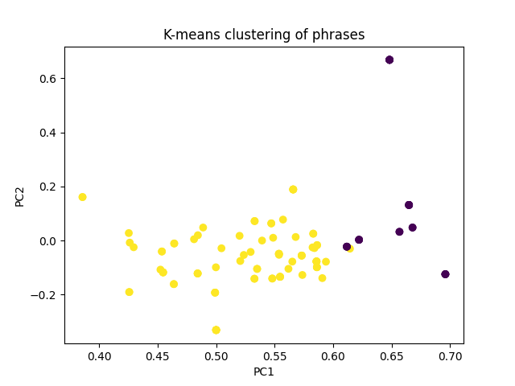

### \#\#\#\# AUTOMATICALLY GENERATED, DO NOT EDIT MANUALLY \#\#\#\#  
*This file was generated by divyaamirtharaj on 2023-04-26 011406*  
**Dataset:** dedoose_data   

## Section Overview
**Section:** Accountability  
**Questions:** [458111, 243034, 245609, 174244]   

## Clusters
###  Cluster Breakdown: 
Cluster 0 accounted for 22.94% of the responses. Cluster 1 accounted for 77.06% of the responses.   

###  Cluster Demographics: 
Respondents in cluster 0 were on average 32.0 years old, and 57.89% are/were married and 11.11% are widowed.  Respondents in cluster 1 were on average 33.98 years old, and 42.42% are/were married and 48.72% are widowed.    

###  Cluster Descriptions: 
The phrases were clustered into two groups based on their similar themes. The first cluster focuses on the importance of holding ISIS accountable for their actions and the respondent's desire for them to receive severe punishment for the harm they have caused. Specifically, the respondent wants those responsible for the suffering they endured to experience the same pain and suffering, and the criminals should be punished to the same standard. The respondent also believes that the leaders of ISIS should be held responsible, as they are ultimately the ones responsible for their actions.

The second cluster focuses on the respondent's desire for revenge and justice for the harm they have experienced. The respondent wants those responsible for the deaths of their family members to face a punishment that is equal to the suffering that they have caused, such as being burned alive in front of their own children. The respondent also believes that all members of ISIS should be held accountable and punished, from the leaders to the lowest-ranking soldiers. They want those responsible to be held accountable for killing some of them and sending away others, and they want justice for these wrongdoings.

Each cluster is differentiated by the focus on either the importance of holding ISIS accountable for their actions or the respondent's desire for revenge and justice. The first cluster focuses on the importance of holding ISIS accountable for their actions and the need for severe punishment for their crimes, while the second cluster focuses on the respondent's desire for revenge and justice for the harm they have experienced.   

***
 

## Appendix:  
**Cluster Graph:**  
  

**Clusters:**  
{0: ['R believes that it is very important for ISIS to be held responsible and accountable for their violations and be taken to court. R believes that those responsible for the suffering they endured should be held accountable and experience the same pain they had to go through. They used to have a peaceful life with their family and relatives, but now many of them have been killed or taken captive, and those who survived have been scattered. R believes that all parties involved should be held to the same standard and receive the same punishment. R believes the criminals should be punished for their crimes and should experience the same pain and suffering that they have caused. R does not think that the criminals should go to court, as nothing wrong has happened to them.', 'R believes that it is very important for ISIS to be held responsible and accountable for their violations and be taken to court. R believes that those responsible for the suffering they endured should be held accountable and experience the same pain they had to go through. They used to have a peaceful life with their family and relatives, but now many of them have been killed or taken captive, and those who survived have been scattered. R believes that all parties involved should be held to the same standard and receive the same punishment. R believes the criminals should be punished for their crimes and should experience the same pain and suffering that they have caused. R does not think that the criminals should go to court, as nothing wrong has happened to them.', 'R believes that it is very important for ISIS to be held responsible and accountable for their violations and be taken to court. R believes that those responsible for the suffering they endured should be held accountable and experience the same pain they had to go through. They used to have a peaceful life with their family and relatives, but now many of them have been killed or taken captive, and those who survived have been scattered. R believes that all parties involved should be held to the same standard and receive the same punishment. R believes the criminals should be punished for their crimes and should experience the same pain and suffering that they have caused. R does not think that the criminals should go to court, as nothing wrong has happened to them.', 'It is extremely important to me that the people who are responsible for the violence I have experienced in connection with Isis are held accountable for their actions. From the perspective of the respondent, the experience of being held captive by ISIS was unimaginably terrible and beyond anything they had ever experienced before. The respondent believes that the commanders of Isis should be held accountable and punished, as well as all of the regular people involved. The respondent also acknowledges that children were taken and recruited against their will, however they feel the parents of these children should be the ones held responsible and not the children themselves. From the perspective of the respondent, they want the commanders of Isis to be held accountable for their actions, but instead of being killed immediately, they should be subjected to a harsh punishment such as having to ask for death 100 times.', 'It is extremely important to me that the people who are responsible for the violence I have experienced in connection with Isis are held accountable for their actions. From the perspective of the respondent, the experience of being held captive by ISIS was unimaginably terrible and beyond anything they had ever experienced before. The respondent believes that the commanders of Isis should be held accountable and punished, as well as all of the regular people involved. The respondent also acknowledges that children were taken and recruited against their will, however they feel the parents of these children should be the ones held responsible and not the children themselves. From the perspective of the respondent, they want the commanders of Isis to be held accountable for their actions, but instead of being killed immediately, they should be subjected to a harsh punishment such as having to ask for death 100 times.', "From the perspective of the respondent, it is extremely important for the criminals to be held accountable. As a respondent, it is very important for me that those who violated my rights are held accountable. I do not understand the dialect being used, but I do know that Isis has taken away my home, my rights, my women, my men, and even my children. It is important for me that those responsible for these actions are held accountable, and I feel that the punishment should be whatever bad things they have done to us, with the same or worse. The pain they have caused is still locked up in our stomach. From the respondent's perspective, they believe that Isis should be held accountable for whatever wrongdoing has occurred and that there were multiple nationalities involved. R: I believe that Isis should be held accountable for their actions and that they should face consequences that are harsher than the harm they have inflicted.", "From the perspective of the respondent, it is extremely important for the criminals to be held accountable. As a respondent, it is very important for me that those who violated my rights are held accountable. I do not understand the dialect being used, but I do know that Isis has taken away my home, my rights, my women, my men, and even my children. It is important for me that those responsible for these actions are held accountable, and I feel that the punishment should be whatever bad things they have done to us, with the same or worse. The pain they have caused is still locked up in our stomach. From the respondent's perspective, they believe that Isis should be held accountable for whatever wrongdoing has occurred and that there were multiple nationalities involved. R: I believe that Isis should be held accountable for their actions and that they should face consequences that are harsher than the harm they have inflicted.", "From the perspective of the respondent, it is extremely important for the criminals to be held accountable. As a respondent, it is very important for me that those who violated my rights are held accountable. I do not understand the dialect being used, but I do know that Isis has taken away my home, my rights, my women, my men, and even my children. It is important for me that those responsible for these actions are held accountable, and I feel that the punishment should be whatever bad things they have done to us, with the same or worse. The pain they have caused is still locked up in our stomach. From the respondent's perspective, they believe that Isis should be held accountable for whatever wrongdoing has occurred and that there were multiple nationalities involved. R: I believe that Isis should be held accountable for their actions and that they should face consequences that are harsher than the harm they have inflicted.", "From the perspective of the respondent, it is extremely important for the criminals to be held accountable. As a respondent, it is very important for me that those who violated my rights are held accountable. I do not understand the dialect being used, but I do know that Isis has taken away my home, my rights, my women, my men, and even my children. It is important for me that those responsible for these actions are held accountable, and I feel that the punishment should be whatever bad things they have done to us, with the same or worse. The pain they have caused is still locked up in our stomach. From the respondent's perspective, they believe that Isis should be held accountable for whatever wrongdoing has occurred and that there were multiple nationalities involved. R: I believe that Isis should be held accountable for their actions and that they should face consequences that are harsher than the harm they have inflicted.", 'R: It is very important for me that the ones who did this to me are punished. R is expressing the pain and anguish they feel as a result of someone taking away their mother and their family. They want justice and will never forget what has happened, even though they are still alive and continue living. They want those who tried to take away their lives and their religion to be held accountable. R believes that all members of ISIS should be punished equally, regardless of their role or position within the organization, as they all participated in the same evil acts. R: The respondent believes that the perpetrators should suffer a punishment that is greater than death and should endure it until death. They should suffer for decades and feel the same pain and anguish that they have caused to the Yazidi people. The respondent acknowledges that speaking to the interviewer is a way to help the Yazidi people and that their voice needs to be heard.', 'R: It is very important for me that the ones who did this to me are punished. R is expressing the pain and anguish they feel as a result of someone taking away their mother and their family. They want justice and will never forget what has happened, even though they are still alive and continue living. They want those who tried to take away their lives and their religion to be held accountable. R believes that all members of ISIS should be punished equally, regardless of their role or position within the organization, as they all participated in the same evil acts. R: The respondent believes that the perpetrators should suffer a punishment that is greater than death and should endure it until death. They should suffer for decades and feel the same pain and anguish that they have caused to the Yazidi people. The respondent acknowledges that speaking to the interviewer is a way to help the Yazidi people and that their voice needs to be heard.', 'R: It is very important for me that the ones who did this to me are punished. R is expressing the pain and anguish they feel as a result of someone taking away their mother and their family. They want justice and will never forget what has happened, even though they are still alive and continue living. They want those who tried to take away their lives and their religion to be held accountable. R believes that all members of ISIS should be punished equally, regardless of their role or position within the organization, as they all participated in the same evil acts. R: The respondent believes that the perpetrators should suffer a punishment that is greater than death and should endure it until death. They should suffer for decades and feel the same pain and anguish that they have caused to the Yazidi people. The respondent acknowledges that speaking to the interviewer is a way to help the Yazidi people and that their voice needs to be heard.', 'R: It is very important for me that the ones who did this to me are punished. R is expressing the pain and anguish they feel as a result of someone taking away their mother and their family. They want justice and will never forget what has happened, even though they are still alive and continue living. They want those who tried to take away their lives and their religion to be held accountable. R believes that all members of ISIS should be punished equally, regardless of their role or position within the organization, as they all participated in the same evil acts. R: The respondent believes that the perpetrators should suffer a punishment that is greater than death and should endure it until death. They should suffer for decades and feel the same pain and anguish that they have caused to the Yazidi people. The respondent acknowledges that speaking to the interviewer is a way to help the Yazidi people and that their voice needs to be heard.', 'R: It is very important for me that the ones who did this to me are punished. R is expressing the pain and anguish they feel as a result of someone taking away their mother and their family. They want justice and will never forget what has happened, even though they are still alive and continue living. They want those who tried to take away their lives and their religion to be held accountable. R believes that all members of ISIS should be punished equally, regardless of their role or position within the organization, as they all participated in the same evil acts. R: The respondent believes that the perpetrators should suffer a punishment that is greater than death and should endure it until death. They should suffer for decades and feel the same pain and anguish that they have caused to the Yazidi people. The respondent acknowledges that speaking to the interviewer is a way to help the Yazidi people and that their voice needs to be heard.', 'From the perspective of the respondent, it is extremely important to hold ISIS accountable for their actions. R: It is important for me to hold them accountable because they have caused a lot of suffering in my life, including taking away my possessions and splitting up my family. From the perspective of the respondent, they believe that there is no difference between a prince and a soldier of Isis and they should all be held accountable. I believe that the perpetrators should be held accountable for their actions and punished in every way possible. Going through a trial or similar process is one way to make sure they are held accountable.', 'From the perspective of the respondent, it is extremely important to hold ISIS accountable for their actions. R: It is important for me to hold them accountable because they have caused a lot of suffering in my life, including taking away my possessions and splitting up my family. From the perspective of the respondent, they believe that there is no difference between a prince and a soldier of Isis and they should all be held accountable. I believe that the perpetrators should be held accountable for their actions and punished in every way possible. Going through a trial or similar process is one way to make sure they are held accountable.', 'From the perspective of the respondent, it is extremely important to hold ISIS accountable for their actions. R: It is important for me to hold them accountable because they have caused a lot of suffering in my life, including taking away my possessions and splitting up my family. From the perspective of the respondent, they believe that there is no difference between a prince and a soldier of Isis and they should all be held accountable. I believe that the perpetrators should be held accountable for their actions and punished in every way possible. Going through a trial or similar process is one way to make sure they are held accountable.', 'From the perspective of the respondent, it is very important for ISIS to be held accountable for their actions. From the perspective of the respondent, the reason for their statement is because of the horrible things done by ISIS, which they consider to be not human. From the perspective of the respondent, they feel that all ISIS fighters are the same and should be held accountable. R believes that ISIS should be held accountable for their actions through the punishment of hanging, and no other form of reparation would be satisfactory.', 'From the perspective of the respondent, it is very important for ISIS to be held accountable for their actions. From the perspective of the respondent, the reason for their statement is because of the horrible things done by ISIS, which they consider to be not human. From the perspective of the respondent, they feel that all ISIS fighters are the same and should be held accountable. R believes that ISIS should be held accountable for their actions through the punishment of hanging, and no other form of reparation would be satisfactory.', "R believes it is very important that ISIS get punished. R explains that the actions of ISIS were incredibly cruel and evil, including killing men and children, selling women, and forcing the conversions of religion from Yazidi to Islam. ISIS surrounded the village, took all their possessions from the men, and then drove them away and killed them. R believes that all people involved with ISIS, including their wives and children, should be held accountable for the crimes committed by the organization. They caused suffering for R's community and took their women to Syria, so they should all face consequences for their actions. R believes that the perpetrators of the crime against their relative should be held accountable and that the punishment should be severe, such as burning them all.", "R believes it is very important that ISIS get punished. R explains that the actions of ISIS were incredibly cruel and evil, including killing men and children, selling women, and forcing the conversions of religion from Yazidi to Islam. ISIS surrounded the village, took all their possessions from the men, and then drove them away and killed them. R believes that all people involved with ISIS, including their wives and children, should be held accountable for the crimes committed by the organization. They caused suffering for R's community and took their women to Syria, so they should all face consequences for their actions. R believes that the perpetrators of the crime against their relative should be held accountable and that the punishment should be severe, such as burning them all.", "R believes it is very important that ISIS get punished. R explains that the actions of ISIS were incredibly cruel and evil, including killing men and children, selling women, and forcing the conversions of religion from Yazidi to Islam. ISIS surrounded the village, took all their possessions from the men, and then drove them away and killed them. R believes that all people involved with ISIS, including their wives and children, should be held accountable for the crimes committed by the organization. They caused suffering for R's community and took their women to Syria, so they should all face consequences for their actions. R believes that the perpetrators of the crime against their relative should be held accountable and that the punishment should be severe, such as burning them all.", "R believes it is very important that ISIS get punished. R explains that the actions of ISIS were incredibly cruel and evil, including killing men and children, selling women, and forcing the conversions of religion from Yazidi to Islam. ISIS surrounded the village, took all their possessions from the men, and then drove them away and killed them. R believes that all people involved with ISIS, including their wives and children, should be held accountable for the crimes committed by the organization. They caused suffering for R's community and took their women to Syria, so they should all face consequences for their actions. R believes that the perpetrators of the crime against their relative should be held accountable and that the punishment should be severe, such as burning them all.", "R believes it is very important that ISIS get punished. R explains that the actions of ISIS were incredibly cruel and evil, including killing men and children, selling women, and forcing the conversions of religion from Yazidi to Islam. ISIS surrounded the village, took all their possessions from the men, and then drove them away and killed them. R believes that all people involved with ISIS, including their wives and children, should be held accountable for the crimes committed by the organization. They caused suffering for R's community and took their women to Syria, so they should all face consequences for their actions. R believes that the perpetrators of the crime against their relative should be held accountable and that the punishment should be severe, such as burning them all.", "R believes it is very important that ISIS get punished. R explains that the actions of ISIS were incredibly cruel and evil, including killing men and children, selling women, and forcing the conversions of religion from Yazidi to Islam. ISIS surrounded the village, took all their possessions from the men, and then drove them away and killed them. R believes that all people involved with ISIS, including their wives and children, should be held accountable for the crimes committed by the organization. They caused suffering for R's community and took their women to Syria, so they should all face consequences for their actions. R believes that the perpetrators of the crime against their relative should be held accountable and that the punishment should be severe, such as burning them all."], 1: ['From the perspective of the respondent, it is very important for the ones who did violence to them to be punished. R: I feel it is important for me to take revenge on those who killed my community, as our neighbors have been able to do. I would like the Iraqi government to allow us to do this, so that we can avenge the deaths of our loved ones. From my perspective, the responsibility should not fall on me since the people in question were our neighbours. From the perspective of the respondent, they believe that those responsible for the deaths of their family members should face a punishment that is equal to the suffering that they have caused, which is to be killed in a way that involves being burned alive in front of their own children.', 'R: It is very important to me that ISIS is punished; it is the highest priority for me. From the perspective of the respondent, the importance of the topic being discussed is paramount and there is nothing else to be said. From the perspective of the respondent, the ISIS organization is a unified team and Abu Bakr al-Baghdadi is the leader responsible for their actions. Therefore, the respondent believes that al-Baghdadi should be the one punished for any crimes committed by ISIS. R is suggesting that the respondent should be killed as a punishment for his orders to attack a country and villages, as a way of illustrating that people must obey their social’s orders no matter what, and the social is responsible for their actions.', "From the respondent's perspective, it is very important that ISIS are held accountable and they want it very badly. R: I feel that they should be punished for the extreme violent crimes they have committed against us, including children and women. They have raped and killed many girls, and justice should be served. From the respondent's perspective, ISIS must be held accountable for the crimes they committed, regardless of their group, religion, or nationality. Specifically, Iraqi ISIS members are the ones who are primarily responsible. The respondent believes that those who should be held accountable should face the worst punishments possible, such as being burned alive, tortured, and killed bit by bit, rather than just being put in prison or captivity.", "From the respondent's perspective, it is very important that ISIS are held accountable and they want it very badly. R: I feel that they should be punished for the extreme violent crimes they have committed against us, including children and women. They have raped and killed many girls, and justice should be served. From the respondent's perspective, ISIS must be held accountable for the crimes they committed, regardless of their group, religion, or nationality. Specifically, Iraqi ISIS members are the ones who are primarily responsible. The respondent believes that those who should be held accountable should face the worst punishments possible, such as being burned alive, tortured, and killed bit by bit, rather than just being put in prison or captivity.", 'R believes that it is important that ISIS criminals should be held accountable for their crimes and that it is the only desired outcome. From the perspective of the respondent, they experienced a variety of oppressive acts from ISIS, such as imprisonment, forced marriage, and death. From my perspective, Masoud Barzani is the one responsible for the violations, and there is no difference between a fighter and a prince in this situation. From the perspective of the respondent, criminals should be held accountable by living through worse conditions than those of the respondent.', 'From my perspective, it is very important that those people who oppressed me are punished for their actions. It is of the utmost importance to me. R: The punishment of those who oppressed us is important because they inflicted too much violence on us, divided our families, and took many lives. I am being asked who must be punished for the cruelty that has been committed. I have suggested my brother, but it is clarified that the opressors need to be punished. I have suggested ISISers, and it is confirmed that all of them need to be punished. From my perspective, we should have responded in kind and given them the same treatment they gave us.', "From the respondent's perspective, it is very important that those responsible for any harm they have experienced be held accountable. They would even go so far as to say that they wish they could kill those responsible. From the respondent's perspective, they were separated from their husband and children and their daughter was sold to ten men at the age of 13. They do not know what happened to their husband as he was taken away while being handcuffed and put in a truck. They are left with unanswered questions and feelings of desperation and helplessness. R: I believe that all members of ISIS should be held accountable, from the leaders to the lowest-ranking soldiers. As a respondent, I feel that it is important for justice to be served for the atrocities committed against us. We want those responsible to be held accountable for killing some of us and sending away others. We have been scattered and separated from each other due to these events, and we want justice for these wrongdoings.", "From the respondent's perspective, it is very important that those responsible for any harm they have experienced be held accountable. They would even go so far as to say that they wish they could kill those responsible. From the respondent's perspective, they were separated from their husband and children and their daughter was sold to ten men at the age of 13. They do not know what happened to their husband as he was taken away while being handcuffed and put in a truck. They are left with unanswered questions and feelings of desperation and helplessness. R: I believe that all members of ISIS should be held accountable, from the leaders to the lowest-ranking soldiers. As a respondent, I feel that it is important for justice to be served for the atrocities committed against us. We want those responsible to be held accountable for killing some of us and sending away others. We have been scattered and separated from each other due to these events, and we want justice for these wrongdoings.", "From the respondent's perspective, it is very important that those responsible for any harm they have experienced be held accountable. They would even go so far as to say that they wish they could kill those responsible. From the respondent's perspective, they were separated from their husband and children and their daughter was sold to ten men at the age of 13. They do not know what happened to their husband as he was taken away while being handcuffed and put in a truck. They are left with unanswered questions and feelings of desperation and helplessness. R: I believe that all members of ISIS should be held accountable, from the leaders to the lowest-ranking soldiers. As a respondent, I feel that it is important for justice to be served for the atrocities committed against us. We want those responsible to be held accountable for killing some of us and sending away others. We have been scattered and separated from each other due to these events, and we want justice for these wrongdoings.", "R believes that it is vitally important for ISIS fighters to be held accountable for their actions. R feels that they have done nothing wrong and were peacefully living at home and working on farms, yet they have been wrongfully damaged. From the respondent's perspective, all ISIS members are bad and there is only one good thing that a few of them allowed them to call their family to hear their voices. They then experienced a brief interruption from a Yazidi boy and some light-hearted discussion, but these conversations were not relevant to the interview question. R believes that ISIS should be punished using the same methods they used on others, such as torture and suffering.", "From the respondent's perspective, it is extremely important that ISIS is punished for the wrongs they have committed. I feel like I have a lot of emotions and experiences that I can't express, and that even if I tried to explain them, it would take a long time and still not be enough. From the perspective of the respondent, they were arrested along with their children, elder brother and mother in Sinjar on the eighth day of the third month and the interviewer then shifted the conversation to another topic before returning to the issue of the respondent's arrest. From the respondent's perspective, they would want to enact a harsh punishment on ISIS by killing their spouses, taking their children away in plain sight, taking their women and girls, and forcibly taking their children from their fathers right in front of them. They believe that this would be a fitting retribution for the evil that ISIS has caused.", "From the respondent's perspective, it is extremely important that ISIS is punished for the wrongs they have committed. I feel like I have a lot of emotions and experiences that I can't express, and that even if I tried to explain them, it would take a long time and still not be enough. From the perspective of the respondent, they were arrested along with their children, elder brother and mother in Sinjar on the eighth day of the third month and the interviewer then shifted the conversation to another topic before returning to the issue of the respondent's arrest. From the respondent's perspective, they would want to enact a harsh punishment on ISIS by killing their spouses, taking their children away in plain sight, taking their women and girls, and forcibly taking their children from their fathers right in front of them. They believe that this would be a fitting retribution for the evil that ISIS has caused.", "R: It is of extreme priority for me that the Isis be held accountable for what they did to me. R: I was upset because the Yazidis were subjected to violence and mistreatment by others. The respondent believes that none of the members of ISIS have any redeeming qualities, and that they should all be treated the same with regards to punishment. From the respondent's perspective, the people responsible for the violence against the Yazidis should face harsh punishments for their actions in order to achieve justice.", "R: I think it is very important that those responsible for the disaster I experienced are held accountable. R: I'm confused as to why someone would do something so heinous - killing all the villagers, kidnapping women and children. R: I believe that all individuals involved in ISIS, regardless of age, should be held accountable and prosecuted. From the respondent's perspective, they do not think that taking the offenders to a court to prosecute them is sufficient. They believe that the offenders would never change for the better and that harsher punishments, such as leaving them without food and water until they die, are necessary.", "R: It is extremely important for us that the ISIS members who committed violence against us are held accountable for their actions. R: I feel that they should be held responsible for their actions because they have committed terrible acts of violence, such as killing innocent people, stealing land, and sexually assaulting women and girls. This has caused immense suffering to our community and cannot be ignored. From the respondent's perspective, all members of ISIS should be held accountable, including both ordinary members and Amirs. As a respondent, I believe that all countries should take action to punish those responsible, whether it be through fighting them or other means. They should not be allowed to get away with their actions.", "R: It is extremely important for us that the ISIS members who committed violence against us are held accountable for their actions. R: I feel that they should be held responsible for their actions because they have committed terrible acts of violence, such as killing innocent people, stealing land, and sexually assaulting women and girls. This has caused immense suffering to our community and cannot be ignored. From the respondent's perspective, all members of ISIS should be held accountable, including both ordinary members and Amirs. As a respondent, I believe that all countries should take action to punish those responsible, whether it be through fighting them or other means. They should not be allowed to get away with their actions.", "R: It is extremely important for us that the ISIS members who committed violence against us are held accountable for their actions. R: I feel that they should be held responsible for their actions because they have committed terrible acts of violence, such as killing innocent people, stealing land, and sexually assaulting women and girls. This has caused immense suffering to our community and cannot be ignored. From the respondent's perspective, all members of ISIS should be held accountable, including both ordinary members and Amirs. As a respondent, I believe that all countries should take action to punish those responsible, whether it be through fighting them or other means. They should not be allowed to get away with their actions.", "R: It is extremely important for us that the ISIS members who committed violence against us are held accountable for their actions. R: I feel that they should be held responsible for their actions because they have committed terrible acts of violence, such as killing innocent people, stealing land, and sexually assaulting women and girls. This has caused immense suffering to our community and cannot be ignored. From the respondent's perspective, all members of ISIS should be held accountable, including both ordinary members and Amirs. As a respondent, I believe that all countries should take action to punish those responsible, whether it be through fighting them or other means. They should not be allowed to get away with their actions.", 'R is indicating that they would take action to hold those who committed or perpetrated violence against civilians during the conflict with Isis accountable, by taking matters into their own hands. R feels that killing a single individual from Isis is not enough to make up for all the pain and suffering they have caused. Despite the fact that they did not cause any physical harm to R, the fear of the unknown was enough for R to feel fearful for themselves, their family, and their community. R is willing to take up arms to fight against Isis and bring justice to those who have been hurt. The respondent believes that everyone affiliated with Isis should be held accountable for their actions and that no one should be punished more than the other. They also believe that no matter the circumstances, killing someone is never justified and that it is better to die than to kill someone. From the perspective of the respondent, they believe that the punishment for those who have inflicted harm on others should be equal to that which was inflicted on them. They believe that a single bullet is not enough and that those responsible should be tortured with methods such as burning with benzene and being forced to run in the streets. They also suggest that people should be made to feel the same pain that their victims and their families experienced.', 'From my perspective, it is very important to me to get revenge on ISIS. R: I have suffered greatly at the hands of the people responsible for these atrocities. My family has faced injury, loss of life and uncertainty, and my parents have been greatly affected. R: I do not believe that everyone in ISIS is the same. I believe that justice should be served for all members of ISIS, not just the leader. All members of ISIS put us through immense suffering and there was not a single good person among them. R: I believe that those responsible for the wrongs committed against us should be arrested and made to experience the same pain and suffering that we endured, to the point where they wish for death.', 'From my perspective, it is very important to me to get revenge on ISIS. R: I have suffered greatly at the hands of the people responsible for these atrocities. My family has faced injury, loss of life and uncertainty, and my parents have been greatly affected. R: I do not believe that everyone in ISIS is the same. I believe that justice should be served for all members of ISIS, not just the leader. All members of ISIS put us through immense suffering and there was not a single good person among them. R: I believe that those responsible for the wrongs committed against us should be arrested and made to experience the same pain and suffering that we endured, to the point where they wish for death.', 'From my perspective, it is very important to me to get revenge on ISIS. R: I have suffered greatly at the hands of the people responsible for these atrocities. My family has faced injury, loss of life and uncertainty, and my parents have been greatly affected. R: I do not believe that everyone in ISIS is the same. I believe that justice should be served for all members of ISIS, not just the leader. All members of ISIS put us through immense suffering and there was not a single good person among them. R: I believe that those responsible for the wrongs committed against us should be arrested and made to experience the same pain and suffering that we endured, to the point where they wish for death.', "R believes that it is very important that Isis be punished for the violence they inflicted on people without any reason. As a Yazidi, I have been through a lot of hardship, as my people have been targeted and killed by those who sought to hurt us. Many of us have been lost, killed, or forced to flee to other countries, and we don't know what has become of them. The respondent believes that the commanders of ISIS should be held accountable for the atrocities committed, and that their Head should also be held responsible. They do not know who the Head of ISIS is, but they believe that the Head is just as bad as the other members of ISIS. From the respondent's perspective, they believe that each person should be held accountable for their actions according to their rights. If someone has committed a violent act, they should face repercussions, but if someone had not committed any violence they should not be punished.", "From my perspective, it is very important that those who committed acts of violence are held accountable and receive appropriate punishment. From the respondent's perspective, it is important to take action against those who have caused harm to their community, as they have seen firsthand the suffering and injustice inflicted on every member, regardless of age or gender. R believes that all Isis fighters and commanders should be held accountable and sees no difference between them. R: I believe the people responsible for the violence should experience the same kind of violence that they inflicted on others, but I am not advocating for hanging them as punishment. I have seen firsthand the violence they have caused, and I believe they should be held accountable for their actions.", "From my perspective, it is very important that those who committed acts of violence are held accountable and receive appropriate punishment. From the respondent's perspective, it is important to take action against those who have caused harm to their community, as they have seen firsthand the suffering and injustice inflicted on every member, regardless of age or gender. R believes that all Isis fighters and commanders should be held accountable and sees no difference between them. R: I believe the people responsible for the violence should experience the same kind of violence that they inflicted on others, but I am not advocating for hanging them as punishment. I have seen firsthand the violence they have caused, and I believe they should be held accountable for their actions.", 'R: I believe that it is essential for justice to be served and for those responsible for the harm inflicted on me and my family to be punished severely. From my perspective, I want all of the people responsible for the suffering of my family to face justice, so that our families can come back alive and safe. R: Everyone should have their rights, from children to elders, not just the leaders. R: Killing them would be a way to ensure Ezidi rights are upheld.', 'R: I believe that it is essential for justice to be served and for those responsible for the harm inflicted on me and my family to be punished severely. From my perspective, I want all of the people responsible for the suffering of my family to face justice, so that our families can come back alive and safe. R: Everyone should have their rights, from children to elders, not just the leaders. R: Killing them would be a way to ensure Ezidi rights are upheld.', 'R: I believe that it is essential for justice to be served and for those responsible for the harm inflicted on me and my family to be punished severely. From my perspective, I want all of the people responsible for the suffering of my family to face justice, so that our families can come back alive and safe. R: Everyone should have their rights, from children to elders, not just the leaders. R: Killing them would be a way to ensure Ezidi rights are upheld.', 'From the perspective of the respondent, getting justice is very important. R believes that they have never done anything wrong to anyone and have never experienced such inhumanity, so they cannot understand why this is happening to them. From my perspective, both leaders and fighters should be held accountable and should be punished accordingly. I believe that those who commit crimes should be punished, with the ultimate punishment being execution.', 'From the perspective of the respondent, getting justice is very important. R believes that they have never done anything wrong to anyone and have never experienced such inhumanity, so they cannot understand why this is happening to them. From my perspective, both leaders and fighters should be held accountable and should be punished accordingly. I believe that those who commit crimes should be punished, with the ultimate punishment being execution.', 'From the perspective of the respondent, getting justice is very important. R believes that they have never done anything wrong to anyone and have never experienced such inhumanity, so they cannot understand why this is happening to them. From my perspective, both leaders and fighters should be held accountable and should be punished accordingly. I believe that those who commit crimes should be punished, with the ultimate punishment being execution.', 'From the perspective of the respondent, getting justice is very important. R believes that they have never done anything wrong to anyone and have never experienced such inhumanity, so they cannot understand why this is happening to them. From my perspective, both leaders and fighters should be held accountable and should be punished accordingly. I believe that those who commit crimes should be punished, with the ultimate punishment being execution.', 'From the perspective of the respondent, getting justice is very important. R believes that they have never done anything wrong to anyone and have never experienced such inhumanity, so they cannot understand why this is happening to them. From my perspective, both leaders and fighters should be held accountable and should be punished accordingly. I believe that those who commit crimes should be punished, with the ultimate punishment being execution.', 'From my perspective, it is very important that ISIS is punished for the suffering they caused me and my community. We experienced a great deal of pain and loss. From my perspective, I have experienced a lot of suffering at the hands of others. They have taken away our freedom, our children, and caused us a lot of pain and suffering. R: I believe that all ISIS commanders and regular soldiers should be judged the same. R believes that the punishment for the people in question should be taken to an international court, rather than a court in Iraq.', 'I believe that those who commit violent acts without justification should be held accountable and face appropriate consequences. As a respondent, I feel it is very important for me because my children were taken away, and I have hope that they will grow up one day. The respondent is of the opinion that punishing the head of ISIS is more important than punishing the other members, and would like to see the members burned in front of their eyes. They also believe that responsibility for this lies with the Sunnites, but not all Sunnites. R: I believe that those who harmed us and our children should be punished severely. I would personally take action and use a knife, the same way they did to our children, to make them feel the pain and suffering they have caused us.', 'R: It is very important to me that ISIS is punished. R: I refuse to forget what happened to me and my people; it is something that I think about constantly, regardless of what I am doing. R believes that all Muslims involved with ISIS, regardless of their role, should be punished equally as they are all following the same teachings of the Quran. R: The punishment for their actions should be severe, as no amount of difficulty in this life could be enough.', "From the respondent's perspective, it is extremely important for the person from Isis who harmed them to be held accountable in an international trial or to be punished. R: I am calling for an international trial because I feel it is the only way to get our rights back. Without an international trial, I do not think we will be able to receive justice in Iraq, as we do not have the support of a country. From the perspective of the respondent, all people involved in the situation should be punished regardless of their position or affiliation. R: If I had the power, I would choose to kill the person responsible for the wrong action.", "From the respondent's perspective, it is extremely important for the person from Isis who harmed them to be held accountable in an international trial or to be punished. R: I am calling for an international trial because I feel it is the only way to get our rights back. Without an international trial, I do not think we will be able to receive justice in Iraq, as we do not have the support of a country. From the perspective of the respondent, all people involved in the situation should be punished regardless of their position or affiliation. R: If I had the power, I would choose to kill the person responsible for the wrong action.", 'R: It is very important to me that ISIS receives punishment for the oppression they committed. From my perspective, it is important for ISIS to be punished because they have done inexcusable things to us. From the perspective of the respondent, the only group or people who deserve to be punished are those associated with ISIS, as they are considered to be the worst perpetrators of any crime. R: I believe that the most appropriate punishment for ISIS is death, as they have caused great suffering and pain to me and countless others.', "R feels that it is important for the people responsible for the violence they experienced to be held accountable and judged, but they don't want the crimes of Isis to be widely known. Instead, they want the Isis to be destroyed and the violence to end. From the perspective of the respondent, they agree with the statement made by the other person. The respondent believes that all of the people involved should be held equally accountable and that there is no difference between their soldiers or their head. From the perspective of the respondent, they want the Isis to be over, but they don't know how to make that happen. They want the world to get rid of it, but they don't know how that can be accomplished.", 'R: It is extremely important to me that the ones who wronged me be held accountable and judged for their actions. I feel so strongly about it that I would even take matters into my own hands if I had the opportunity. From the perspective of the respondent, I am listening to and considering the statement that has been made. I suggested that everyone should be held responsible, and the respondent agreed, but clarified that some were worse than others. R believes that those responsible should be punished in the same way they punished their victims, rather than going through the court system. They should be killed in the same way innocent people were killed.', 'R: It is extremely important to me that the ones who wronged me be held accountable and judged for their actions. I feel so strongly about it that I would even take matters into my own hands if I had the opportunity. From the perspective of the respondent, I am listening to and considering the statement that has been made. I suggested that everyone should be held responsible, and the respondent agreed, but clarified that some were worse than others. R believes that those responsible should be punished in the same way they punished their victims, rather than going through the court system. They should be killed in the same way innocent people were killed.', 'R: It is extremely important to me that the ones who wronged me be held accountable and judged for their actions. I feel so strongly about it that I would even take matters into my own hands if I had the opportunity. From the perspective of the respondent, I am listening to and considering the statement that has been made. I suggested that everyone should be held responsible, and the respondent agreed, but clarified that some were worse than others. R believes that those responsible should be punished in the same way they punished their victims, rather than going through the court system. They should be killed in the same way innocent people were killed.', 'R: It is extremely important to me that the ones who wronged me be held accountable and judged for their actions. I feel so strongly about it that I would even take matters into my own hands if I had the opportunity. From the perspective of the respondent, I am listening to and considering the statement that has been made. I suggested that everyone should be held responsible, and the respondent agreed, but clarified that some were worse than others. R believes that those responsible should be punished in the same way they punished their victims, rather than going through the court system. They should be killed in the same way innocent people were killed.', 'R: It is very important to me that ISIS be held accountable for their violence against me and other civilians. They have caused so much suffering and I believe that they should face justice. R: From my perspective, the Yazidis have been treated unfairly and the people responsible should be punished for their actions as they do not view the Yazidis as human beings, but instead as infidels. From my perspective, all of the members of ISIS should be punished for the suffering they inflicted on me and others. Despite talking to many people from America, Germany, and France, no one took action for over three years. R: I believe that ISIS should be subject to appropriate punishment for their cruelty towards me and others.', 'It is extremely important for me to have my rights respected by those who have done wrong to me. R: We are seeking to reclaim our rights because of the wrongs that have been done to us. From the perspective of the respondent, the leader of ISIS was more accountable for the wrongdoings than the other members of ISIS, such as the army and children. The respondent believes that all of the leaders were responsible for the bad things happening, not just the one identified as "Ameer." From the perspective of the respondent, they feel that those who have done bad things should be held accountable, but due to their inability to do so, they hope that God will take justice into their own hands and grant them the rights they are due.', "R wants a severe punishment for those who caused them suffering. R: I felt that the actions of [the other party] caused me a lot of suffering. From the respondent's perspective, there is no distinction between men, women, and children when it comes to receiving punishment. R believes that the punishment should be severe.", "R wants a severe punishment for those who caused them suffering. R: I felt that the actions of [the other party] caused me a lot of suffering. From the respondent's perspective, there is no distinction between men, women, and children when it comes to receiving punishment. R believes that the punishment should be severe.", "From the perspective of the respondent, it is extremely important that ISIS fighters be held accountable for their actions. R is expressing frustration at being wrongfully targeted and negatively impacted by an unjust system. They did not do anything wrong and were peacefully living and working when they were unexpectedly affected. R believes that all ISIS are bad and that there is only one good thing that some of them do, which is allowing family members to hear their voices. The interview was then interrupted by a Yazidi boy, which led to some humorous discussions about the German people's generosity, but this has nothing to do with the question asked. R believes that those associated with ISIS should be punished in a similar way that they inflicted suffering on others.", "From the perspective of the respondent, it is extremely important that ISIS fighters be held accountable for their actions. R is expressing frustration at being wrongfully targeted and negatively impacted by an unjust system. They did not do anything wrong and were peacefully living and working when they were unexpectedly affected. R believes that all ISIS are bad and that there is only one good thing that some of them do, which is allowing family members to hear their voices. The interview was then interrupted by a Yazidi boy, which led to some humorous discussions about the German people's generosity, but this has nothing to do with the question asked. R believes that those associated with ISIS should be punished in a similar way that they inflicted suffering on others.", 'From the perspective of the respondent, the topic is of great importance. I feel angry and hurt by the wrongs they have done to us, and I want them to face the same consequences. The respondent indicated that there is no difference among them, they are all the same. From the perspective of the respondent, they wish for their experience to be shared by others.', 'From the perspective of the respondent, the topic is of great importance. I feel angry and hurt by the wrongs they have done to us, and I want them to face the same consequences. The respondent indicated that there is no difference among them, they are all the same. From the perspective of the respondent, they wish for their experience to be shared by others.', 'From the perspective of the respondent, the topic is of great importance. I feel angry and hurt by the wrongs they have done to us, and I want them to face the same consequences. The respondent indicated that there is no difference among them, they are all the same. From the perspective of the respondent, they wish for their experience to be shared by others.', 'R: It is very important to me that ISIS soldiers receive the punishment they deserve. From the perspective of the respondent, it is important to demand justice because they have seen firsthand the injustice and brutality inflicted on their village by an outside force, such as a government. They want to use their voice to demand accountability and justice for these wrongdoings. From the perspective of the respondent, it appears that they were betrayed by their neighbors, the Mitilta nation, who had previously been their guests and ate and drank with them. The respondent believes that it was the Muslims in Arab villages, specifically the Sunnis and Turkmens, who were responsible for the tragedy that befell them. From the respondent\'s perspective, they do not want any promises made to those who have caused them suffering, but instead want justice in the form of suffering for those who caused them harm. They do not want them to remain in the neighborhood, and instead want them to "vanish."', 'R: It is very important to me that ISIS soldiers receive the punishment they deserve. From the perspective of the respondent, it is important to demand justice because they have seen firsthand the injustice and brutality inflicted on their village by an outside force, such as a government. They want to use their voice to demand accountability and justice for these wrongdoings. From the perspective of the respondent, it appears that they were betrayed by their neighbors, the Mitilta nation, who had previously been their guests and ate and drank with them. The respondent believes that it was the Muslims in Arab villages, specifically the Sunnis and Turkmens, who were responsible for the tragedy that befell them. From the respondent\'s perspective, they do not want any promises made to those who have caused them suffering, but instead want justice in the form of suffering for those who caused them harm. They do not want them to remain in the neighborhood, and instead want them to "vanish."', 'R: It is very important to me that ISIS soldiers receive the punishment they deserve. From the perspective of the respondent, it is important to demand justice because they have seen firsthand the injustice and brutality inflicted on their village by an outside force, such as a government. They want to use their voice to demand accountability and justice for these wrongdoings. From the perspective of the respondent, it appears that they were betrayed by their neighbors, the Mitilta nation, who had previously been their guests and ate and drank with them. The respondent believes that it was the Muslims in Arab villages, specifically the Sunnis and Turkmens, who were responsible for the tragedy that befell them. From the respondent\'s perspective, they do not want any promises made to those who have caused them suffering, but instead want justice in the form of suffering for those who caused them harm. They do not want them to remain in the neighborhood, and instead want them to "vanish."', 'From my perspective, it is very important that the ISIS members who committed violence against me are held accountable for their actions. We believe that they should be punished and we would like to be the ones to do it. R: I am deeply affected by the plight of those who are being held captive and suffer from hunger, lack of clothing, and torture every day. The fact that my car, possessions, and house were taken from me and burned down is of little consequence compared to the atrocities being committed against these people. It is crucial that those responsible for murdering young people, torturing children, and selling girls be held accountable. R: The leader of ISIS and all ISIS members should be held accountable for the situation that led to the surrender of 700,000 people without any resistance. The country we were living in did not fight to protect us and this enabled ISIS to capture us. R: I believe the offenders should be held accountable for their actions and face appropriate punishment in international courts.', "From the respondent's perspective, it is extremely important that the people who did something to them be punished. I understand that you will be asking me more questions and that they may be difficult to answer, but I am willing to provide as much information as possible in order to give an accurate account of what happened. I can confirm that we were captured and killed. From the respondent's perspective, they believe all members of ISIS should be held equally accountable, regardless of their rank or position. From the perspective of the respondent, they believe that those responsible should experience the same consequences that they inflicted on others.", "From the respondent's perspective, it is extremely important that the people who did something to them be punished. I understand that you will be asking me more questions and that they may be difficult to answer, but I am willing to provide as much information as possible in order to give an accurate account of what happened. I can confirm that we were captured and killed. From the respondent's perspective, they believe all members of ISIS should be held equally accountable, regardless of their rank or position. From the perspective of the respondent, they believe that those responsible should experience the same consequences that they inflicted on others.", 'From the perspective of the respondent, it is very important that those who committed violence against them are held accountable and face the same consequences that they experienced. From the perspective of the respondent, their desire for punishment is rooted in the horrific injustices their community has experienced, including the destruction of homes, abduction of young girls, murder of young boys and fathers, and the killing of elderly women. R believes that all of the people who said they belonged to the Islamic state, many Arabs from Arab countries, and all of the neighbors that were considered traitors should be punished for the harm they caused. R believes that the perpetrators should suffer the same horrible things that were done to them, such as being buried in a hole, starving to death, and being held captive. They should suffer more than what they experienced.', "R: It is very important for me that ISIS is punished, with a rating of four on a scale. R: My children were taken from me three years ago, my entire family is under their control, including my husband, and it’s extremely important for me to get them back. R believes that everyone responsible for taking away the rights of the respondent should be punished, including children, women, and commanders in ISIS. R: The punishment should be the most severe, and I wish I could do the same to those who have taken my children. My son was three years old when they took him, and he has been in their hands ever since. Last year, my children called me over the phone and I haven't been in contact with them since. They were being tortured and their phones were taken away if someone in their family escaped. After that, they were not able to call me. My son and daughter are in different towns and are only allowed to come together occasionally.", "R: It is very important for me that ISIS is punished, with a rating of four on a scale. R: My children were taken from me three years ago, my entire family is under their control, including my husband, and it’s extremely important for me to get them back. R believes that everyone responsible for taking away the rights of the respondent should be punished, including children, women, and commanders in ISIS. R: The punishment should be the most severe, and I wish I could do the same to those who have taken my children. My son was three years old when they took him, and he has been in their hands ever since. Last year, my children called me over the phone and I haven't been in contact with them since. They were being tortured and their phones were taken away if someone in their family escaped. After that, they were not able to call me. My son and daughter are in different towns and are only allowed to come together occasionally.", 'From the perspective of the respondent, it is very important that any actions taken against them by ISIS be investigated and taken to trial, and that a lawsuit be brought if needed. From my perspective, the reason why this is important to me is because I cannot understand why someone would do such terrible things to us when we are all humans and should be treated equally. R: From my perspective, all members of ISIS are the same and should be treated equally in terms of investigation and judgement. From the perspective of the respondent, if ISIS members were to be judged, there would be no benefit in a trial as it would not work. Therefore, they should be punished in the same way that they treated the respondent.', 'From the perspective of the respondent, it is very important that any actions taken against them by ISIS be investigated and taken to trial, and that a lawsuit be brought if needed. From my perspective, the reason why this is important to me is because I cannot understand why someone would do such terrible things to us when we are all humans and should be treated equally. R: From my perspective, all members of ISIS are the same and should be treated equally in terms of investigation and judgement. From the perspective of the respondent, if ISIS members were to be judged, there would be no benefit in a trial as it would not work. Therefore, they should be punished in the same way that they treated the respondent.', 'From the perspective of the respondent, it is extremely important for the people to be held accountable. R wants to see his men, people, and village Kocho held accountable for what happened to them. He does not want to return to Iraq, but instead wants to see his people in Germany, where he currently resides. R: From my perspective, all members of ISIS should be held accountable and punished equally, regardless of their nationality. This includes Arabs living around us, as well as those from Saudi Arabia, Egypt, Afghanistan, America, and Germany. The punishment should be the same for all of them, to reflect the gravity of the crimes they have committed. The respondent believes that those members of Isis should be given the worst punishment possible, and that this punishment should be consistent regardless of whether the individual is an Arab or a member of Isis. They also believe that the punishment should be as severe as the bad things that were done to them, and should be carried out by anyone who loves and wants to help them.', 'From the perspective of the respondent, it is extremely important for the people to be held accountable. R wants to see his men, people, and village Kocho held accountable for what happened to them. He does not want to return to Iraq, but instead wants to see his people in Germany, where he currently resides. R: From my perspective, all members of ISIS should be held accountable and punished equally, regardless of their nationality. This includes Arabs living around us, as well as those from Saudi Arabia, Egypt, Afghanistan, America, and Germany. The punishment should be the same for all of them, to reflect the gravity of the crimes they have committed. The respondent believes that those members of Isis should be given the worst punishment possible, and that this punishment should be consistent regardless of whether the individual is an Arab or a member of Isis. They also believe that the punishment should be as severe as the bad things that were done to them, and should be carried out by anyone who loves and wants to help them.', "R: I consider it very important that ISIS is punished and that they receive the punishment they deserve. I would like them to experience something even more severe than what we had to go through. R wants ISIS to see worse because they have caused tremendous suffering and pain to them, including the loss of loved ones and the kidnapping of women, all without any justification. From the respondent's perspective, the Sunnis in Iraq and Syria were responsible for the cruelty inflicted upon them. They were their neighbors who then turned on them and killed them. R wishes that all Muslims, Sunnis and Shias, would be removed from the world, as they have betrayed their hosts. He believes that Yazidis and Shias are brothers, and that they come from the same source, but he has no trust in them anymore.", 'From my perspective, it is very important that ISIS be punished. From the perspective of the respondent, it is important to speak out about their situation because they have done nothing wrong, yet have been subjected to unfair treatment and suffering. From the perspective of the respondent, they believe that all involved in ISIS should be held accountable and punished the same. R is suggesting that the punishment should be hanging.', 'From my perspective, I would like to get my rights back and have my revenge on ISIS for the suffering they have caused me. I would like to be able to destroy them and make them experience the same pain they have caused me. From my perspective, I have been driven out of my homeland and have had nearly 60 of my family members taken captive. I have no idea where they are now and have been struggling to survive since then, sleeping outside and in need. R: I believe all members of ISIS, regardless of rank or position, are equal. R wants the people in question to die.', 'From my perspective, I would like to get my rights back and have my revenge on ISIS for the suffering they have caused me. I would like to be able to destroy them and make them experience the same pain they have caused me. From my perspective, I have been driven out of my homeland and have had nearly 60 of my family members taken captive. I have no idea where they are now and have been struggling to survive since then, sleeping outside and in need. R: I believe all members of ISIS, regardless of rank or position, are equal. R wants the people in question to die.', 'From my perspective, it is extremely important to me that those who have wronged me are brought to court. I would like to be able to confront them so that I can make them feel the suffering that I have endured. I believe it is important for those responsible for killing my family members to be punished as a means of seeking justice and closure. R is advocating for all members of ISIS, Turkmens and Sunnis to be held accountable for their actions, regardless of rank or position. He believes all those involved should be punished for their crimes. R wants the perpetrators to be brought to court in Iraq, where they will be tried and killed for strangling their spouses.', "R: It is very important for me that ISIS is punished. R: I asked if she understands Kurdish, but she only understands numbers and ‘very much’. My question was why punishing ISIS is important for me, and I answered that it is because of the crimes they have committed. From the respondent's perspective, they believe that ISIS troops and emeers are all one entity and that if they weren't, they would not be attending the same events. R: I believe the appropriate punishment for them is death in order to prevent them from continuing their evil deeds.", "R: It is very important for me that ISIS is punished. R: I asked if she understands Kurdish, but she only understands numbers and ‘very much’. My question was why punishing ISIS is important for me, and I answered that it is because of the crimes they have committed. From the respondent's perspective, they believe that ISIS troops and emeers are all one entity and that if they weren't, they would not be attending the same events. R: I believe the appropriate punishment for them is death in order to prevent them from continuing their evil deeds.", "R: It is very important for me that ISIS is punished. R: I asked if she understands Kurdish, but she only understands numbers and ‘very much’. My question was why punishing ISIS is important for me, and I answered that it is because of the crimes they have committed. From the respondent's perspective, they believe that ISIS troops and emeers are all one entity and that if they weren't, they would not be attending the same events. R: I believe the appropriate punishment for them is death in order to prevent them from continuing their evil deeds.", "From the perspective of the respondent, it is extremely important that Isis be held in an international trial and go to jail. She said “ mum, I saw everything with my own eyes”.  She stayed with me for 7 days and kept talking about her experience. From the perspective of the respondent, they were held captive for nine months and experienced fear when Isis was looking for women without husbands or men. They don't know specific people to hold accountable, but think that if the prince was to be punished or killed, it would be great. They also don't know enough about the regular soldiers of Isis to comment on the difference of opinion between them and the prince or if they should be punished. R: I do not agree with killing anyone.", "From the perspective of the respondent, it is extremely important that Isis be held in an international trial and go to jail. She said “ mum, I saw everything with my own eyes”.  She stayed with me for 7 days and kept talking about her experience. From the perspective of the respondent, they were held captive for nine months and experienced fear when Isis was looking for women without husbands or men. They don't know specific people to hold accountable, but think that if the prince was to be punished or killed, it would be great. They also don't know enough about the regular soldiers of Isis to comment on the difference of opinion between them and the prince or if they should be punished. R: I do not agree with killing anyone.", "From the perspective of the respondent, it is extremely important that Isis be held in an international trial and go to jail. She said “ mum, I saw everything with my own eyes”.  She stayed with me for 7 days and kept talking about her experience. From the perspective of the respondent, they were held captive for nine months and experienced fear when Isis was looking for women without husbands or men. They don't know specific people to hold accountable, but think that if the prince was to be punished or killed, it would be great. They also don't know enough about the regular soldiers of Isis to comment on the difference of opinion between them and the prince or if they should be punished. R: I do not agree with killing anyone.", 'R: I feel that it is very important that ISIS receives justice for the cruelty they have inflicted, or experiences the same suffering I have endured. From the perspective of the respondent, they experienced great suffering as a result of their family members being taken by a force or group, with two of their brothers having three children, one of whom was 20 years old. All of them were held captive and subjected to terrible conditions. R is unable to comprehend the question and is unable to answer it. R believes that those responsible for a wrongdoing should not be allowed to escape punishment and should be held accountable for their actions.', 'From my perspective, it is essential that anyone who commits violence be held accountable. R: I have seen firsthand how bad these people are and why it is important for me to stay away from them. They are violent and have killed people for simply speaking their minds. They cannot be trusted because they are prone to betrayal. They are all bad and should be avoided. The respondent has seen the soldiers and has been told multiple times why they were doing something, to which they responded that they were following orders from someone higher up. It is implied that the chief is the one responsible for this. From the perspective of the respondent, they believe that those in ISIS should be killed, rather than judged, as they have done nothing good and their opinion is not valued.', 'From my perspective, it is essential that anyone who commits violence be held accountable. R: I have seen firsthand how bad these people are and why it is important for me to stay away from them. They are violent and have killed people for simply speaking their minds. They cannot be trusted because they are prone to betrayal. They are all bad and should be avoided. The respondent has seen the soldiers and has been told multiple times why they were doing something, to which they responded that they were following orders from someone higher up. It is implied that the chief is the one responsible for this. From the perspective of the respondent, they believe that those in ISIS should be killed, rather than judged, as they have done nothing good and their opinion is not valued.', "R: It is extremely important to me that the people responsible for the violence inflicted upon innocent people be held accountable and punished. R: It is important to me that those who have committed violence are held accountable and that their victims are compensated for the harm done to them. From the respondent's perspective, there appears to be a difference between Isis fighters and commanders, with the commanders having a higher level of authority and the small ones following the orders given by the commanders. From the respondent's perspective, they believe that the only way to hold Isis members accountable is through the death penalty. They have not heard any reports of how the members have been punished so far. They suggest that if any Isis members are captured, the country should allow for them to be punished.", 'From the perspective of the respondent, it is very important that members of Isis be held accountable and judged in a court of law. From my perspective, it is important to take action against those who have wronged us and caused so much destruction and loss of life. We need to make sure that such a tragedy does not happen again. R believes that all members of Isis should be held accountable, regardless of rank or position. As the respondent, I believe that the individuals in question should be punished for all of their actions and for their involvement in the war. A trial is not enough and I do not know who would sue them. However, I do think that they should have a real trial.', "The respondent emphasized the importance of holding the perpetrators of violence accountable for their actions. They recounted the horrific violence that was inflicted on their family and community, including the death of their husband, their brother in law's daughter being taken captive, and their co-wife's children being taken captive. The respondent also described how Isis brought them meat to cook, but they refused because of the pain of seeing the woman taken away by force. The respondent wants justice for the violence done to them and their family. As the respondent, I agree with the statement that was presented. From the perspective of the respondent, the commander should be held responsible for any wrongdoings as they would have ordered their soldiers to do it. The soldiers themselves are not responsible as they would have only followed orders from their Head. From the respondent's perspective, it appears difficult for the Head to be held accountable, either through judgement or some other means, such as revenge or payment of money.", 'I believe it is vital that those who caused harm to me and my community are held accountable for their actions. As a respondent, I feel frustrated and confused as to why my husband has had to endure so much suffering, hunger, and deportation, when the Yazidi people have done nothing wrong to anyone. I am now left with no knowledge of his whereabouts. From the perspective of the respondent, they believe that all Arabs should be held accountable for the horrible things they have done. R suggests that those responsible for the situation should experience a level of hardship that is greater than what was experienced.']}  

**Demographic Breakdown:**  
{0: [{'sex': 'female', 'age': '35', 'marital_status': 'True', 'widow': 'False', 'ethnicity': '', 'religion': ''}, {'sex': 'female', 'age': 'NULL', 'marital_status': 'NULL', 'widow': 'NULL', 'ethnicity': 'NULL', 'religion': 'NULL'}, {'sex': 'female', 'age': 'NULL', 'marital_status': 'NULL', 'widow': 'NULL', 'ethnicity': 'NULL', 'religion': 'NULL'}, {'sex': 'female', 'age': '27', 'marital_status': 'False', 'widow': 'NULL', 'ethnicity': '', 'religion': ''}, {'sex': 'female', 'age': 'NULL', 'marital_status': 'NULL', 'widow': 'NULL', 'ethnicity': 'NULL', 'religion': 'NULL'}, {'sex': 'female', 'age': '40', 'marital_status': 'True', 'widow': 'True', 'ethnicity': '', 'religion': ''}, {'sex': 'female', 'age': 'NULL', 'marital_status': 'True', 'widow': 'NULL', 'ethnicity': '', 'religion': ''}, {'sex': 'female', 'age': '44', 'marital_status': 'True', 'widow': 'False', 'ethnicity': '', 'religion': ''}, {'sex': 'female', 'age': '35', 'marital_status': 'True', 'widow': 'False', 'ethnicity': '', 'religion': ''}, {'sex': 'female', 'age': '20', 'marital_status': 'False', 'widow': 'NULL', 'ethnicity': '', 'religion': ''}, {'sex': 'female', 'age': '21', 'marital_status': 'True', 'widow': 'NULL', 'ethnicity': 'Kurdish Yazidi', 'religion': ''}, {'sex': 'female', 'age': '35', 'marital_status': 'True', 'widow': 'False', 'ethnicity': 'NULL', 'religion': ''}, {'sex': 'female', 'age': 'NULL', 'marital_status': 'True', 'widow': 'False', 'ethnicity': '', 'religion': ''}, {'sex': 'female', 'age': '29', 'marital_status': 'False', 'widow': 'NULL', 'ethnicity': '', 'religion': ''}, {'sex': 'female', 'age': 'NULL', 'marital_status': 'False', 'widow': 'NULL', 'ethnicity': '', 'religion': ''}, {'sex': 'female', 'age': '31', 'marital_status': 'False', 'widow': 'False', 'ethnicity': '', 'religion': ''}, {'sex': 'female', 'age': '32', 'marital_status': 'True', 'widow': 'NULL', 'ethnicity': '', 'religion': ''}, {'sex': 'female', 'age': '27', 'marital_status': 'True', 'widow': 'NULL', 'ethnicity': '', 'religion': 'NULL'}, {'sex': 'female', 'age': 'NULL', 'marital_status': 'NULL', 'widow': 'NULL', 'ethnicity': 'NULL', 'religion': 'NULL'}, {'sex': 'female', 'age': 'NULL', 'marital_status': 'True', 'widow': 'False', 'ethnicity': '', 'religion': ''}, {'sex': 'female', 'age': 'NULL', 'marital_status': 'NULL', 'widow': 'NULL', 'ethnicity': 'NULL', 'religion': 'NULL'}, {'sex': 'female', 'age': 'NULL', 'marital_status': 'NULL', 'widow': 'NULL', 'ethnicity': 'NULL', 'religion': 'NULL'}, {'sex': 'female', 'age': '27', 'marital_status': 'False', 'widow': 'NULL', 'ethnicity': '', 'religion': ''}, {'sex': 'female', 'age': '45', 'marital_status': 'False', 'widow': 'False', 'ethnicity': '', 'religion': 'Yazidi.'}, {'sex': 'female', 'age': '', 'marital_status': 'False', 'widow': 'NULL', 'ethnicity': '', 'religion': 'Yazidi.'}], 1: [{'sex': 'female', 'age': '36', 'marital_status': 'True', 'widow': 'False', 'ethnicity': '', 'religion': ''}, {'sex': 'female', 'age': '36', 'marital_status': 'False', 'widow': 'NULL', 'ethnicity': '', 'religion': 'Yazidi'}, {'sex': 'female', 'age': '39', 'marital_status': 'False', 'widow': 'NULL', 'ethnicity': '', 'religion': ''}, {'sex': 'female', 'age': '45', 'marital_status': 'True', 'widow': 'False', 'ethnicity': '', 'religion': ''}, {'sex': 'female', 'age': 'NULL', 'marital_status': 'True', 'widow': 'True', 'ethnicity': '', 'religion': ''}, {'sex': 'female', 'age': 'NULL', 'marital_status': 'False', 'widow': 'NULL', 'ethnicity': 'NULL', 'religion': ''}, {'sex': 'female', 'age': '50', 'marital_status': 'False', 'widow': 'True', 'ethnicity': 'Ezidi, German', 'religion': 'Unknown'}, {'sex': 'female', 'age': '22', 'marital_status': 'True', 'widow': 'NULL', 'ethnicity': '', 'religion': ''}, {'sex': 'female', 'age': 'NULL', 'marital_status': 'False', 'widow': 'True', 'ethnicity': '', 'religion': 'Yazidi'}, {'sex': 'female', 'age': '26', 'marital_status': 'False', 'widow': 'NULL', 'ethnicity': '', 'religion': ''}, {'sex': 'female', 'age': 'NULL', 'marital_status': 'True', 'widow': 'True', 'ethnicity': '', 'religion': ''}, {'sex': 'female', 'age': 'NULL', 'marital_status': 'False', 'widow': 'NULL', 'ethnicity': '', 'religion': ''}, {'sex': 'female', 'age': 'NULL', 'marital_status': 'NULL', 'widow': 'NULL', 'ethnicity': '', 'religion': 'Yazidi'}, {'sex': 'female', 'age': 'NULL', 'marital_status': 'NULL', 'widow': 'NULL', 'ethnicity': '', 'religion': ''}, {'sex': 'female', 'age': '27', 'marital_status': 'False', 'widow': 'NULL', 'ethnicity': '', 'religion': ''}, {'sex': 'female', 'age': '28-29', 'marital_status': 'False', 'widow': 'NULL', 'ethnicity': '', 'religion': ''}, {'sex': 'female', 'age': '77', 'marital_status': 'True', 'widow': 'True', 'ethnicity': '', 'religion': ''}, {'sex': 'female', 'age': 'NULL', 'marital_status': 'False', 'widow': 'False', 'ethnicity': '', 'religion': ''}, {'sex': 'female', 'age': '40', 'marital_status': 'False', 'widow': 'False', 'ethnicity': '', 'religion': ''}, {'sex': 'female', 'age': '30', 'marital_status': 'True', 'widow': 'False', 'ethnicity': '', 'religion': ''}, {'sex': 'female', 'age': '24', 'marital_status': 'True', 'widow': 'False', 'ethnicity': 'Yazidi.', 'religion': ''}, {'sex': 'female', 'age': 'NULL', 'marital_status': 'NULL', 'widow': 'NULL', 'ethnicity': 'NULL', 'religion': 'NULL'}, {'sex': 'female', 'age': '37', 'marital_status': 'True', 'widow': 'True', 'ethnicity': '', 'religion': ''}, {'sex': 'female', 'age': '21', 'marital_status': 'False', 'widow': 'NULL', 'ethnicity': '', 'religion': ''}, {'sex': 'female', 'age': '37', 'marital_status': 'True', 'widow': 'True', 'ethnicity': '', 'religion': 'Ezidism'}, {'sex': 'female', 'age': 'NULL', 'marital_status': 'False', 'widow': 'NULL', 'ethnicity': '', 'religion': ''}, {'sex': 'female', 'age': '37', 'marital_status': 'False', 'widow': 'NULL', 'ethnicity': '', 'religion': ''}, {'sex': 'female', 'age': 'NULL', 'marital_status': 'NULL', 'widow': 'NULL', 'ethnicity': 'NULL', 'religion': 'NULL'}, {'sex': 'female', 'age': 'NULL', 'marital_status': 'NULL', 'widow': 'NULL', 'ethnicity': '', 'religion': ''}, {'sex': 'female', 'age': '33', 'marital_status': 'True', 'widow': 'True', 'ethnicity': '', 'religion': ''}, {'sex': 'female', 'age': 'NULL', 'marital_status': 'Unfortunately, I do not have that information.', 'widow': 'NULL', 'ethnicity': 'Kurdish Ezidi', 'religion': ''}, {'sex': 'female', 'age': '26', 'marital_status': 'False', 'widow': 'NULL', 'ethnicity': '', 'religion': ''}, {'sex': 'female', 'age': 'NULL', 'marital_status': 'False', 'widow': 'NULL', 'ethnicity': '', 'religion': ''}, {'sex': 'female', 'age': 'NULL', 'marital_status': 'True', 'widow': 'False', 'ethnicity': '', 'religion': ''}, {'sex': 'female', 'age': '33', 'marital_status': 'True', 'widow': 'False', 'ethnicity': '', 'religion': ''}, {'sex': 'female', 'age': 'NULL', 'marital_status': 'False', 'widow': 'NULL', 'ethnicity': '', 'religion': ''}, {'sex': 'female', 'age': '36', 'marital_status': 'False', 'widow': 'True', 'ethnicity': '', 'religion': ''}, {'sex': 'female', 'age': '28', 'marital_status': 'True', 'widow': 'True', 'ethnicity': '', 'religion': 'Yezidi.'}, {'sex': 'female', 'age': 'NULL', 'marital_status': 'NULL', 'widow': 'False', 'ethnicity': 'NULL', 'religion': 'Yazidi'}, {'sex': 'female', 'age': 'NULL', 'marital_status': 'False', 'widow': 'NULL', 'ethnicity': '', 'religion': ''}, {'sex': 'female', 'age': '50', 'marital_status': 'False', 'widow': 'NULL', 'ethnicity': '', 'religion': 'Yazidi.'}, {'sex': 'female', 'age': '31', 'marital_status': 'True', 'widow': 'True', 'ethnicity': 'NULL', 'religion': ''}, {'sex': 'female', 'age': 'NULL', 'marital_status': 'NULL', 'widow': 'NULL', 'ethnicity': 'Yazidi.', 'religion': ''}, {'sex': 'female', 'age': '19', 'marital_status': 'False', 'widow': 'NULL', 'ethnicity': '', 'religion': 'NULL'}, {'sex': 'female', 'age': '23', 'marital_status': 'False', 'widow': 'NULL', 'ethnicity': '', 'religion': ''}, {'sex': 'female', 'age': 'NULL', 'marital_status': 'NULL', 'widow': 'NULL', 'ethnicity': 'NULL', 'religion': ''}, {'sex': 'female', 'age': 'NULL', 'marital_status': 'True', 'widow': 'False', 'ethnicity': '', 'religion': ''}, {'sex': 'female', 'age': 'NULL', 'marital_status': 'NULL', 'widow': 'NULL', 'ethnicity': 'NULL', 'religion': 'NULL'}, {'sex': 'female', 'age': '26', 'marital_status': 'False', 'widow': 'NULL', 'ethnicity': '', 'religion': ''}, {'sex': 'female', 'age': '19', 'marital_status': 'False', 'widow': 'NULL', 'ethnicity': '', 'religion': 'NULL'}, {'sex': 'female', 'age': '', 'marital_status': 'False', 'widow': 'NULL', 'ethnicity': '', 'religion': ''}, {'sex': 'female', 'age': 'NULL', 'marital_status': 'NULL', 'widow': 'NULL', 'ethnicity': 'NULL', 'religion': 'NULL'}, {'sex': 'female', 'age': 'NULL', 'marital_status': 'NULL', 'widow': 'NULL', 'ethnicity': 'NULL', 'religion': 'NULL'}, {'sex': 'female', 'age': 'NULL', 'marital_status': 'False', 'widow': 'NULL', 'ethnicity': '', 'religion': ''}, {'sex': 'female', 'age': '23', 'marital_status': 'False', 'widow': 'NULL', 'ethnicity': '', 'religion': ''}, {'sex': 'female', 'age': '30', 'marital_status': 'False', 'widow': 'False', 'ethnicity': 'Yazidi', 'religion': ''}, {'sex': 'female', 'age': 'NULL', 'marital_status': 'True', 'widow': 'True', 'ethnicity': '', 'religion': ''}, {'sex': 'female', 'age': '29', 'marital_status': 'False', 'widow': 'True', 'ethnicity': '', 'religion': ''}, {'sex': 'female', 'age': 'NULL', 'marital_status': 'Therefore, I cannot answer this question.', 'widow': 'NULL', 'ethnicity': 'NULL', 'religion': 'NULL'}, {'sex': 'female', 'age': 'NULL', 'marital_status': 'True', 'widow': 'False', 'ethnicity': '', 'religion': ''}, {'sex': 'female', 'age': 'NULL', 'marital_status': 'NULL', 'widow': 'NULL', 'ethnicity': '', 'religion': ''}, {'sex': 'female', 'age': '', 'marital_status': 'True', 'widow': 'NULL', 'ethnicity': 'Yazidi', 'religion': ''}, {'sex': 'female', 'age': 'NULL', 'marital_status': 'False', 'widow': 'NULL', 'ethnicity': '', 'religion': ''}, {'sex': 'female', 'age': 'NULL', 'marital_status': 'NULL', 'widow': 'NULL', 'ethnicity': 'NULL', 'religion': 'NULL'}, {'sex': 'female', 'age': '73', 'marital_status': 'False', 'widow': 'True', 'ethnicity': 'Yazidi.', 'religion': ''}, {'sex': 'female', 'age': '18', 'marital_status': 'False', 'widow': 'NULL', 'ethnicity': '', 'religion': ''}, {'sex': 'female', 'age': 'NULL', 'marital_status': 'False', 'widow': 'NULL', 'ethnicity': '', 'religion': 'Yazidi'}, {'sex': 'female', 'age': '37', 'marital_status': 'True', 'widow': 'True', 'ethnicity': 'NULL', 'religion': 'Yazidi'}, {'sex': 'female', 'age': '', 'marital_status': 'True', 'widow': 'False', 'ethnicity': '', 'religion': ''}, {'sex': 'female', 'age': 'NULL', 'marital_status': 'False', 'widow': 'NULL', 'ethnicity': '', 'religion': ''}, {'sex': 'female', 'age': '19', 'marital_status': 'NULL', 'widow': 'False', 'ethnicity': '', 'religion': ''}, {'sex': 'female', 'age': 'Therefore, it is unclear. NULL', 'marital_status': 'NULL', 'widow': 'NULL', 'ethnicity': 'NULL', 'religion': 'NULL'}, {'sex': 'female', 'age': '45', 'marital_status': 'True', 'widow': 'True', 'ethnicity': 'Yazidi.', 'religion': ''}, {'sex': 'female', 'age': '40', 'marital_status': 'NULL', 'widow': 'False', 'ethnicity': '', 'religion': ''}, {'sex': 'female', 'age': 'NULL', 'marital_status': 'True', 'widow': 'True', 'ethnicity': '', 'religion': ''}, {'sex': 'female', 'age': '43', 'marital_status': 'True', 'widow': 'False', 'ethnicity': 'Mixed ethnicity.', 'religion': ''}, {'sex': 'female', 'age': 'NULL', 'marital_status': 'False', 'widow': 'NULL', 'ethnicity': '', 'religion': ''}, {'sex': 'female', 'age': '', 'marital_status': 'True', 'widow': 'False', 'ethnicity': '', 'religion': ''}, {'sex': 'female', 'age': '', 'marital_status': 'True', 'widow': 'True', 'ethnicity': '', 'religion': ''}, {'sex': 'female', 'age': '39', 'marital_status': 'False', 'widow': 'False', 'ethnicity': 'NULL', 'religion': ''}, {'sex': 'female', 'age': '', 'marital_status': 'False', 'widow': 'True', 'ethnicity': '', 'religion': ''}, {'sex': 'female', 'age': 'NULL', 'marital_status': 'True', 'widow': 'NULL', 'ethnicity': '', 'religion': ''}, {'sex': 'female', 'age': 'NULL', 'marital_status': 'False', 'widow': 'False', 'ethnicity': '', 'religion': ''}, {'sex': 'female', 'age': '27', 'marital_status': 'True', 'widow': 'False', 'ethnicity': '', 'religion': ''}]}  
