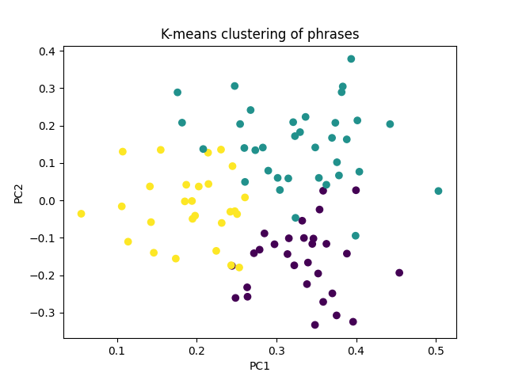

### \#\#\#\# AUTOMATICALLY GENERATED, DO NOT EDIT MANUALLY \#\#\#\#  
*This file was generated by divyaamirtharaj on 2023-04-26 011343*  
**Dataset:** dedoose_data   

## Section Overview
**Section:** Justice  
**Questions:** [785919]   

## Clusters
###  Cluster Breakdown: 
Cluster 0 accounted for 47.22% of the responses. Cluster 1 accounted for 12.04% of the responses. Cluster 2 accounted for 40.74% of the responses.   

###  Cluster Demographics: 
Respondents in cluster 0 were on average 33.85 years old, and 60.53% are/were married and 40.0% are widowed.  Respondents in cluster 2 were on average 32.68 years old, and 36.84% are/were married and 38.1% are widowed.  Respondents in cluster 1 were on average 34.67 years old, and 22.22% are/were married and 100.0% are widowed.    

###  Cluster Descriptions: 
Cluster 0 appears to focus on justice as a means of restoring rights to those who have had them taken away or denied. Major themes found in this cluster include the idea of justice as a means of ensuring that perpetrators of wrongdoing are held accountable, restoring material possessions, protecting religious beliefs and rights, and reclaiming rights that have been withheld. This cluster is differentiated from the other two clusters in that it focuses more on justice as a means of restoring rights and restoring the balance of power.

Cluster 1 appears to focus on understanding the concept of justice and the rights of the Yazidi people. Major themes found in this cluster include the lack of justice in Iraq and the Kurdistan region, the lack of protection and resources available to the Yazidi people, the lack of understanding of the concept of justice, and the need for international protection. This cluster is differentiated from the other two clusters in that it focuses more on understanding justice and the rights of the Yazidi people, rather than on justice as a means of restoring rights.

Cluster 2 appears to focus on justice as a means of punishing those responsible for violence and restoring rights taken away from the Yazidi people. Major themes found in this cluster include the need for retribution for wrongs that have been done, the need for protection for the Yazidi people, the need for legal and governmental authorities to uphold fair and equal rights, the need for equality between men and women, and the need to take matters into one's own hands in order to achieve justice. This cluster is differentiated from the other two clusters in that it focuses more on justice as a means of punishing perpetrators of violence and restoring rights taken away from the Yazidi people.   

***
 

## Appendix:  
**Cluster Graph:**  
  

**Clusters:**  
{0: ["From the respondent's perspective, justice means that the perpetrators of the crimes committed against them must be held accountable for their actions. They want their rights to be restored and to see justice done.", "From the respondent's perspective, justice means that the perpetrators of the crimes committed against them must be held accountable for their actions. They want their rights to be restored and to see justice done.", "From the respondent's perspective, justice means that the perpetrators of the crimes committed against them must be held accountable for their actions. They want their rights to be restored and to see justice done.", 'From the perspective of the respondent, they are trying to understand the concept of justice and rights, but are having difficulty understanding what it means for them.', 'From the perspective of the respondent, justice would be having their husband and brother return to them, and nothing else matters to them more than that.', 'The respondent believes that justice would mean that people who have been the victims of violence, such as the woman who had fled ISIS, would be protected and provided with the means to keep their children. They are angry that even in their current situation, those who have sacrificed for their children cannot keep them. The respondent has seen first-hand the horrible conditions Yazidi people have had to endure, and has witnessed people trying to commit suicide out of desperation.', 'From my perspective, justice means holding people accountable for their actions and ensuring that people who have done wrong receive their due punishment. It also means that we have the right to seek justice and to have our rights respected.', 'The respondent has indicated that when they hear the word justice, they have a lot of flashbacks to an awful experience they faced at the hands of ISIS. They do not feel they have received justice for what happened to them.', 'R believes that their rights have been lost due to a lack of action taken by others to protect the Yazidis. They have discussed justice with others, but nobody has done anything to help their situation.', 'R believes that their rights have been lost due to a lack of action taken by others to protect the Yazidis. They have discussed justice with others, but nobody has done anything to help their situation.', 'R believes that their rights have been lost due to a lack of action taken by others to protect the Yazidis. They have discussed justice with others, but nobody has done anything to help their situation.', 'From the perspective of the respondent, justice for them means being able to regain their rights and bring justice to those who have been oppressed. They would like to do this by killing each member of ISIS with their own hands. However, they are aware of the court system, and are willing to accept a trial for criminal such as ISIS, as long as they can see them being killed in the trial.', 'From the perspective of the respondent, justice for them means being able to regain their rights and bring justice to those who have been oppressed. They would like to do this by killing each member of ISIS with their own hands. However, they are aware of the court system, and are willing to accept a trial for criminal such as ISIS, as long as they can see them being killed in the trial.', 'From the perspective of the respondent, justice means that people should not be denied their rights and that someone should help those in need. The respondent was moved by the story of a blind man who did not receive the help he needed, demonstrating their commitment to justice and fair treatment.', "From the respondent's perspective, justice means when life returns to the way it was before, with people able to provide for their families and their territory beautiful. For the respondent, this would involve restoring their homes, land, and the ability for their men to work and provide for them.", 'From the perspective of the respondent, justice means much more than just avoiding wrongdoing. It means having the necessary rights to live comfortably and for the nation to be comfortable as well. The respondent does not know what steps should be taken to give their rights back, but they understand that the rights must be given back in order for justice to be done.', 'From the perspective of the respondent, justice means much more than just avoiding wrongdoing. It means having the necessary rights to live comfortably and for the nation to be comfortable as well. The respondent does not know what steps should be taken to give their rights back, but they understand that the rights must be given back in order for justice to be done.', 'From the perspective of the respondent, they are looking for justice for the struggles they have faced and want their rights to be respected and acknowledged. They want to make sure that their experience is not forgotten and that they receive the justice they deserve.', 'From the perspective of the respondent, justice means having their rights restored after the terrible events they experienced at the hands of ISIS.', "From the perspective of the respondent, justice means that the person who acted unfairly against them will eventually be made to pay for their actions. They also feel that the interviewer is aware of what they have gone through, so they don't feel the need to explain further.", 'R believes that justice is about restoring the rights taken away by someone, whether it be the government or another entity. They have not seen justice in their own lives, where their families have been separated from them for 3 years without any resolution. They used to believe in justice, but now it is just a word to them.', "R believes that justice is getting back the rights that were taken away from them by Isis. To them, justice would be the governments restoring the rights they had before they were captured and punishing the ones responsible for the loss of those rights. In addition, they believe justice would mean getting back their mother, stepmother, aunts, uncles' wives, and sister with her four children, as well as the wives of their brother in laws.", "From the respondent's perspective, justice means that those who have been affected by ISIS must have their rights restored and that ISIS criminals should be held accountable for their crimes.", 'From the perspective of the respondent, justice means having their rights respected and having the countries help them in achieving that. Specifically, they would like to have their people back who are in captivity and for their rights to be available everywhere. They will not forget what ISIS has done to them, and are deeply affected by the experiences of being separated from their loved ones, killed, and taken away.', "From the respondent's perspective, justice means seeking retribution for wrongs done to them. They believe that those who have wronged them should suffer, but that ultimately this should be left to God to decide.", "From the respondent's perspective, justice means seeking retribution for wrongs done to them. They believe that those who have wronged them should suffer, but that ultimately this should be left to God to decide.", 'From the perspective of the respondent, justice means taking back the rights that were taken from them, such as their family or other rights that were taken by Isis. They wish for God to do the same to them as they did to them.', 'From the perspective of the respondent, they have not seen justice and feel that no one has done anything that could be considered "just" for them.', 'From my perspective, justice means ensuring that the Yazidis find peace and comfort. I would demand justice for the Yazidis by advocating for their rights and protections, seeking to provide them with a safe place to live, and fighting for them to have access to the resources they need to live a good life.', 'From the perspective of the respondent, justice means that when someone takes something away from them, whether it be their rights or their honor, they want to reclaim these things and restore their life to the way it was before.', 'From the perspective of the respondent, justice means that when someone takes something away from them, whether it be their rights or their honor, they want to reclaim these things and restore their life to the way it was before.', 'From the perspective of the respondent, justice means that when someone takes something away from them, whether it be their rights or their honor, they want to reclaim these things and restore their life to the way it was before.', 'From the perspective of the respondent, justice means thinking of the violations that were done by ISIS.', 'From the perspective of the respondent, justice means thinking of the violations that were done by ISIS.', "From the perspective of the respondent, justice means the state must protect people's rights, particularly when those rights are being persecuted and violated by another group. The respondent believes that everyone has the right to practice their religion, as it is chosen for them by God’s will.", "R believes that ISIS should be punished for their brutal actions, as they took away people's rights. He hopes that they are made to suffer the same as those they hurt and that they do not get away with their actions.", 'From the perspective of the respondent, justice means that they have been denied their rights and the only way to get them back is to take matters into their own hands.', 'From the perspective of the respondent, justice means that those who have suffered should be given the right to stay in their current location and be reunited with their families, and be treated with respect by the program that welcomed them.', 'From the perspective of the respondent, justice is about ensuring that what has been done to them is not worse than what they have done to others, and that justice is done to them.', 'From the perspective of the respondent, justice would involve being able to live in safety with their family, for which they are thankful to the people who have taken them in.', 'The respondent has indicated that they understand Justice to mean equality, and that they appreciate the help they have been given by Germany. They have also expressed that they have family in Kurdistan who are living in a tent and have no one.', 'The respondent is highly distressed when recounting her traumatic experiences and reveals that the suffering they endured is irreversible and no country or power is able to rectify it to the extent of returning them to their past lives before. The respondent implies that only God has the power to reverse the trauma and suffering they have endured. The respondent then agrees to continue the conversation.', 'From the perspective of the respondent, justice has not been served and they feel that they need to take action in order to regain what is rightfully theirs. They feel that nothing has been done to address the legal issues they have with those who have wronged them.', 'From the perspective of the respondent, justice means that only God can restore their rights when they have been taken away.', 'From the perspective of the respondent, justice means that only God can restore their rights when they have been taken away.', 'From the perspective of the respondent, justice means that only God can restore their rights when they have been taken away.', 'The respondent does not believe that they will have justice, as the Isis have taken their rights and left nothing. They feel that the violence done to them was too great, and they would rather stay in the streets than return to Iraq.', "From the perspective of the respondent, justice is to get rid of Isis, who have caused a lot of harm to both the respondent and other Muslims. The respondent believes that if the court is just, Isis will be sentenced for their actions. The respondent also mentions their Muslim neighbours, who they were close to before Isis came, but then became enemies and delivered the respondent to Isis. The respondent believes that even if they had done something wrong, they didn't deserve to be betrayed by their neighbours.", "From the respondent's perspective, justice is about recognizing their rights and being able to seek remedy for the wrongs that have been done to them, such as being forced to drink unsanitary water. They have also seen people, including Yazidi women and children, being treated as commodities, taken away and their rights violated. This has caused them to feel distressed and helpless, with no justice or remedy for the wrongs that have been done.", "From the perspective of the respondent, justice means that their people in Iraq who are still in captivity of Isis will be able to be brought to Germany to live with them. Furthermore, justice would be for the respondent's current living situation to be improved, as they are currently living in a building with ten families and forty children, which is making them feel overwhelmed and unable to focus.", 'From the perspective of the respondent, they feel that they do not have the rights they should have in their current situation and that the only thing they can think of is the freedom of their captives. They feel that if they had their rights, their men would have already been freed and they would have the right to be defended. The respondent expresses a deep sense of suffering for their men still held in ISIS captivity.'], 2: ['From my perspective, justice means being rescued from captivity, instead of experiencing violence and having no rights. We called for help for fifteen days and no one came, making us feel helpless and hopeless.', 'The respondent is saying that justice means civil law that is not within politics and that people should not be traitors. The respondent also expresses a sense of happiness when surrounded by people who have no evil within them.', 'As a respondent, I believe that justice is when people are able to get the rights that they deserve, and that those who commit wrongs should be punished without any interference from Islam or any other force.', 'The respondent believes that justice means being together and having the rights they were denied returned to them. To them, the most important thing is being together as a family and having the honor that was taken away restored. Material possessions are not as important as having their family together and having their rights respected.', 'From the perspective of the respondent, justice is not being served - despite the fact that governments were aware of the siege happening in Kojo village, nothing was done to help the people suffering from it.', 'From my perspective, justice is the return of my family and the past, as it is a meaningful concept to me.', "R: I understand that I have rights, but I'm not sure what these rights are. I know that my children want their rights from Iraq and Kurdistan, and that we are here now looking for our rights. When I say human rights, I mean the right to be free from oppression and have equal rights as everyone else here.", "From the perspective of the respondent, justice means that the state must protect people's rights and recognize that religions are chosen by God's will, not by the people themselves. When people are persecuted for their religious beliefs, they should be aware that these beliefs are not chosen by them and are therefore entitled to protection.", "R: I feel like I have experienced a lot of injustice, as my nephews and nieces were taken from me by force while they were crying. I'm not sure if there is justice in the world, but I believe that God will ultimately ensure that I get my rights back.", 'The respondent believes that when justice is discussed, it usually involves taking revenge which is not possible for Yazidis as they have nothing in their power.', 'From my perspective, justice means reclaiming our rights from those who are withholding them.', 'The respondent states that the Yazidi people do not have rights and need international protection in order to help and aid themselves. They have previously tried to demand their rights, but have been met with nothing.', 'Justice to me means fairness, accountability and respect for human rights. It means that no one is above the law, and that all people should be treated equally and with dignity. It means that governments should be held accountable for their actions and that individuals should not be allowed to use their power to oppress others.', 'From my perspective, justice means having my rights respected. My rights include being able to live in a safe and comfortable place, and to not be subjected to captivity or other abuses. It also means that people should give me back what I am due, and not take away my life or my freedom without due process. My life should be one of dignity and respect, regardless of any challenges I may face.', 'We want all people to know what they have done and to have justice for what happened to us. We want them to see justice and feel it.', 'R believes that justice is very important, as it gives people the respect and rights they deserve. He has seen the lack of justice in Iraq, where government jobs are only given to relatives and poor people are left helpless. In contrast, he has seen how justice is respected in Germany, where elderly in the camp are helped and taken care of. He has also seen markets, schools, and kindergartens, which he never saw before in Iraq.', "From the respondent's perspective, justice means that everyone should be treated fairly regardless of their religious or cultural background. They believe that Yazidis are being unfairly targeted by ISIS and do not have any international support, while other religious groups are being backed by foreign countries.", 'R believes that justice is about getting what is right, or their rights. They are looking for truth and for nothing bad to happen to them.', "From the respondent's perspective, justice means nothing in Iraq as the country is run by nepotism and corruption. They experienced inequality and injustice firsthand as they were not given a tent despite being an ISIS victim, while other women who escaped from ISIS got boxes of money. The source of these boxes of money is unknown.", 'The respondent believes that justice is about people having good working conditions and situations regardless of location or context.', 'R: Justice to me means having the right to be treated fairly, and my rights are the basic human rights that everyone is entitled to.', 'R believes that justice can only be achieved when the perpetrators of the atrocities they experienced receive the same treatment in return.', 'From my perspective, justice means an official and legal authority that upholds fairness and equality.', 'The respondent is not sure what justice means to them and is unable to think about it. They are mainly concerned with the safety of their daughters in Iraq, as they are scared of something unexpected happening there.', 'From the perspective of the respondent, justice is not something that exists in Iraq, as there is no concept of people having rights. This has been especially difficult for women and girls, as they have no protection of any kind. It is unclear what could be done to gain rights in Iraq.', 'R believes that justice is when people are held accountable for their actions and are held responsible for the losses they cause. Injustice is when people are not held accountable and their losses are not taken into account. This is especially true in Iraq, where the rights of Yazidis are not respected.', 'From my perspective, justice and rights mean achieving equality between men and women. Growing up, my family supported me when I refused to follow outdated customs, which showed me that standing up for my beliefs was important to them. My father even referred to me as a lawyer, which inspired me to strive for equality.', 'From the perspective of the respondent, justice and rights mean achieving equality between men and women, which is something they personally experienced as a child when they refused to follow the backwardness customs and their family supported them for doing so.', 'From the perspective of the respondent, justice is equal respect and non-discrimination between religions, particularly their own. They cannot accept any actions that attack their honor or kill their men, or harm their 8-year-old girls.', "Justice, for me, is being able to move to my brother's and be comfortable. I've tried to get help from everyone I meet and have even thought about hiring a lawyer, but it costs €2,000 - something I don't have. Until I can be reunited with my brother, I don't feel I have justice.", 'From the perspective of the respondent, justice means that all people should be treated equally and should not be subjected to discrimination or segregation.', 'From the perspective of the respondent, justice means being treated equally and without prejudice, regardless of religion or other factors. The respondent feels that this is the case in Germany, where there is no oppression or prosecution of an individual based on their identity. The respondent believes that everyone should have the same rights, and should not be denied any rights because of their identity.', "From my perspective, justice means having a basic understanding of my rights and being treated fairly and equitably. I don't have a detailed understanding of what justice entails, but I trust that I will be treated with respect and fairness.", 'I view justice as an important concept that holds society together and upholds fairness and equality.', "From the perspective of the respondent, fairness means being heard and having the opportunity to take care of one's family. It is about being able to get what one is due and being able to access the resources necessary to do so.", 'The respondent understands that justice is when someone takes your rights and then you get your rights back and they get punished. They believe there is justice in the world, specifically in Germany, but not in Iraq where no one gets punished for committing crimes. They are unsure if there will be justice in Iraq in the future.', "R believes that justice is when there is no war and everyone gets their due rights. On their side, they don't want war, everyone should be looking after their own jobs and have the right intentions. They are frustrated by the 73 decrees of death placed on them just because they are Yazidis.", 'From my perspective, justice is having the same rights and privileges that everyone else has, but I have not been able to enjoy those rights in my own lands.', 'From the perspective of the respondent, justice requires all humans to be united and treated equally, without distinctions made based on identity. As they have not seen this in their life so far, they do not believe justice exists.', 'The respondent does not understand what the interviewer is asking and expresses a wish that God would not leave what is rightfully theirs to ISIS. When asked what should happen, the respondent states that ISIS should die.', 'From the perspective of the respondent, justice means humanity, safety and peace for all people.', 'From my perspective, justice is not being provided by our state. We are hoping that European countries will take action to ensure justice is done.', 'From my perspective, justice means following the law and doing what is right. It is important to be just and adhere to the law in order to create an equitable society.', 'From the perspective of the respondent, justice means taking matters into their own hands and punishing those responsible for the violence they experienced by killing them one by one until they are all gone.'], 1: ['The respondent does not understand the definition of justice and asked for clarification in Arabic.', 'The respondent has experienced bad things in the camp they are living in, and they have been trying to get transferred out of it but have been unsuccessful. They have made problems for themselves as a result. They do not understand the meaning of justice when the interpreter says it in Arabic or Kurdish.', 'The respondent has experienced bad things in the camp they are living in, and they have been trying to get transferred out of it but have been unsuccessful. They have made problems for themselves as a result. They do not understand the meaning of justice when the interpreter says it in Arabic or Kurdish.', 'The respondent has experienced bad things in the camp they are living in, and they have been trying to get transferred out of it but have been unsuccessful. They have made problems for themselves as a result. They do not understand the meaning of justice when the interpreter says it in Arabic or Kurdish.', "From the respondent's perspective, they believe that the treatment of Yazidis in the past three years has been unacceptable. They have experienced or heard of many injustices, including the kidnapping of wives and children, and are shocked that such a thing could happen in any state.", 'From the perspective of the respondent, the situation was going well until ISIS arrived and disrupted it.', 'From the perspective of the respondent, the situation was going well until ISIS arrived and disrupted it.', 'From the perspective of the respondent, the situation was going well until ISIS arrived and disrupted it.', 'From the perspective of the respondent, justice and law are concepts that they have not seen in action in Iraq and do not believe they exist.', 'From the perspective of the respondent, justice and law are concepts that they have not seen in action in Iraq and do not believe they exist.', "From the perspective of the respondent, they do not understand what justice means and require further clarification. The interviewer has explained that justice is when someone does wrong and a higher authority, such as the police, brings the respondent's rights back, which the respondent can then understand.", 'From the perspective of the respondent, they were asked a question about what justice means to them and responded in German. The interviewer then responded in German and then asked if the respondent should continue speaking in Arabic or Kurdish.', "The respondent has not heard of the concept of justice or law in the context of the world and is unfamiliar with the words in both English and their native language. When asked about the people's law, they acknowledge this as a concept they have heard of."]}  

**Demographic Breakdown:**  
{0: [{'sex': 'female', 'age': '35', 'marital_status': 'True', 'widow': 'False', 'ethnicity': '', 'religion': ''}, {'sex': 'female', 'age': 'NULL', 'marital_status': 'NULL', 'widow': 'NULL', 'ethnicity': 'NULL', 'religion': 'NULL'}, {'sex': 'female', 'age': 'NULL', 'marital_status': 'NULL', 'widow': 'NULL', 'ethnicity': 'NULL', 'religion': 'NULL'}, {'sex': 'female', 'age': 'NULL', 'marital_status': 'False', 'widow': 'True', 'ethnicity': '', 'religion': 'Yazidi'}, {'sex': 'female', 'age': 'NULL', 'marital_status': 'True', 'widow': 'True', 'ethnicity': '', 'religion': ''}, {'sex': 'female', 'age': 'NULL', 'marital_status': 'False', 'widow': 'NULL', 'ethnicity': '', 'religion': ''}, {'sex': 'female', 'age': '27', 'marital_status': 'False', 'widow': 'NULL', 'ethnicity': '', 'religion': ''}, {'sex': 'female', 'age': '77', 'marital_status': 'True', 'widow': 'True', 'ethnicity': '', 'religion': ''}, {'sex': 'female', 'age': '30', 'marital_status': 'True', 'widow': 'False', 'ethnicity': '', 'religion': ''}, {'sex': 'female', 'age': '24', 'marital_status': 'True', 'widow': 'False', 'ethnicity': 'Yazidi.', 'religion': ''}, {'sex': 'female', 'age': 'NULL', 'marital_status': 'NULL', 'widow': 'NULL', 'ethnicity': 'NULL', 'religion': 'NULL'}, {'sex': 'female', 'age': '27', 'marital_status': 'False', 'widow': 'NULL', 'ethnicity': '', 'religion': ''}, {'sex': 'female', 'age': 'NULL', 'marital_status': 'NULL', 'widow': 'NULL', 'ethnicity': 'NULL', 'religion': 'NULL'}, {'sex': 'female', 'age': '21', 'marital_status': 'False', 'widow': 'NULL', 'ethnicity': '', 'religion': ''}, {'sex': 'female', 'age': '40', 'marital_status': 'True', 'widow': 'True', 'ethnicity': '', 'religion': ''}, {'sex': 'female', 'age': 'NULL', 'marital_status': 'True', 'widow': 'NULL', 'ethnicity': '', 'religion': ''}, {'sex': 'female', 'age': '44', 'marital_status': 'True', 'widow': 'False', 'ethnicity': '', 'religion': ''}, {'sex': 'female', 'age': 'NULL', 'marital_status': 'NULL', 'widow': 'NULL', 'ethnicity': '', 'religion': ''}, {'sex': 'female', 'age': '33', 'marital_status': 'True', 'widow': 'True', 'ethnicity': '', 'religion': ''}, {'sex': 'female', 'age': '26', 'marital_status': 'False', 'widow': 'NULL', 'ethnicity': '', 'religion': ''}, {'sex': 'female', 'age': '20', 'marital_status': 'False', 'widow': 'NULL', 'ethnicity': '', 'religion': ''}, {'sex': 'female', 'age': '35', 'marital_status': 'True', 'widow': 'False', 'ethnicity': 'NULL', 'religion': ''}, {'sex': 'female', 'age': 'NULL', 'marital_status': 'True', 'widow': 'False', 'ethnicity': '', 'religion': ''}, {'sex': 'female', 'age': '28', 'marital_status': 'True', 'widow': 'True', 'ethnicity': '', 'religion': 'Yezidi.'}, {'sex': 'female', 'age': '32', 'marital_status': 'True', 'widow': 'NULL', 'ethnicity': '', 'religion': ''}, {'sex': 'female', 'age': 'NULL', 'marital_status': 'False', 'widow': 'NULL', 'ethnicity': '', 'religion': ''}, {'sex': 'female', 'age': '50', 'marital_status': 'False', 'widow': 'NULL', 'ethnicity': '', 'religion': 'Yazidi.'}, {'sex': 'female', 'age': 'NULL', 'marital_status': 'NULL', 'widow': 'NULL', 'ethnicity': 'Yazidi.', 'religion': ''}, {'sex': 'female', 'age': '23', 'marital_status': 'False', 'widow': 'NULL', 'ethnicity': '', 'religion': ''}, {'sex': 'female', 'age': 'NULL', 'marital_status': 'NULL', 'widow': 'NULL', 'ethnicity': 'NULL', 'religion': ''}, {'sex': 'female', 'age': 'NULL', 'marital_status': 'True', 'widow': 'False', 'ethnicity': '', 'religion': ''}, {'sex': 'female', 'age': 'NULL', 'marital_status': 'NULL', 'widow': 'NULL', 'ethnicity': 'NULL', 'religion': 'NULL'}, {'sex': 'female', 'age': '27', 'marital_status': 'True', 'widow': 'NULL', 'ethnicity': '', 'religion': 'NULL'}, {'sex': 'female', 'age': 'NULL', 'marital_status': 'NULL', 'widow': 'NULL', 'ethnicity': 'NULL', 'religion': 'NULL'}, {'sex': 'female', 'age': '26', 'marital_status': 'False', 'widow': 'NULL', 'ethnicity': '', 'religion': ''}, {'sex': 'female', 'age': 'NULL', 'marital_status': 'NULL', 'widow': 'NULL', 'ethnicity': '', 'religion': ''}, {'sex': 'female', 'age': '37', 'marital_status': 'True', 'widow': 'True', 'ethnicity': 'NULL', 'religion': 'Yazidi'}, {'sex': 'female', 'age': 'NULL', 'marital_status': 'False', 'widow': 'NULL', 'ethnicity': '', 'religion': ''}, {'sex': 'female', 'age': '19', 'marital_status': 'NULL', 'widow': 'False', 'ethnicity': '', 'religion': ''}, {'sex': 'female', 'age': '45', 'marital_status': 'True', 'widow': 'True', 'ethnicity': 'Yazidi.', 'religion': ''}, {'sex': 'female', 'age': 'NULL', 'marital_status': 'True', 'widow': 'True', 'ethnicity': '', 'religion': ''}, {'sex': 'female', 'age': '43', 'marital_status': 'True', 'widow': 'False', 'ethnicity': 'Mixed ethnicity.', 'religion': ''}, {'sex': 'female', 'age': '', 'marital_status': 'True', 'widow': 'False', 'ethnicity': '', 'religion': ''}, {'sex': 'female', 'age': 'NULL', 'marital_status': 'True', 'widow': 'False', 'ethnicity': '', 'religion': ''}, {'sex': 'female', 'age': 'NULL', 'marital_status': 'NULL', 'widow': 'NULL', 'ethnicity': 'NULL', 'religion': 'NULL'}, {'sex': 'female', 'age': 'NULL', 'marital_status': 'NULL', 'widow': 'NULL', 'ethnicity': 'NULL', 'religion': 'NULL'}, {'sex': 'female', 'age': '45', 'marital_status': 'False', 'widow': 'False', 'ethnicity': '', 'religion': 'Yazidi.'}, {'sex': 'female', 'age': '', 'marital_status': 'True', 'widow': 'True', 'ethnicity': '', 'religion': ''}, {'sex': 'female', 'age': '39', 'marital_status': 'False', 'widow': 'False', 'ethnicity': 'NULL', 'religion': ''}, {'sex': 'female', 'age': 'NULL', 'marital_status': 'False', 'widow': 'False', 'ethnicity': '', 'religion': ''}, {'sex': 'female', 'age': '27', 'marital_status': 'True', 'widow': 'False', 'ethnicity': '', 'religion': ''}], 2: [{'sex': 'female', 'age': '36', 'marital_status': 'True', 'widow': 'False', 'ethnicity': '', 'religion': ''}, {'sex': 'female', 'age': '36', 'marital_status': 'False', 'widow': 'NULL', 'ethnicity': '', 'religion': 'Yazidi'}, {'sex': 'female', 'age': '39', 'marital_status': 'False', 'widow': 'NULL', 'ethnicity': '', 'religion': ''}, {'sex': 'female', 'age': '45', 'marital_status': 'True', 'widow': 'False', 'ethnicity': '', 'religion': ''}, {'sex': 'female', 'age': 'NULL', 'marital_status': 'True', 'widow': 'True', 'ethnicity': '', 'religion': ''}, {'sex': 'female', 'age': 'NULL', 'marital_status': 'False', 'widow': 'NULL', 'ethnicity': 'NULL', 'religion': ''}, {'sex': 'female', 'age': '50', 'marital_status': 'False', 'widow': 'True', 'ethnicity': 'Ezidi, German', 'religion': 'Unknown'}, {'sex': 'female', 'age': '26', 'marital_status': 'False', 'widow': 'NULL', 'ethnicity': '', 'religion': ''}, {'sex': 'female', 'age': 'NULL', 'marital_status': 'NULL', 'widow': 'NULL', 'ethnicity': '', 'religion': 'Yazidi'}, {'sex': 'female', 'age': 'NULL', 'marital_status': 'NULL', 'widow': 'NULL', 'ethnicity': '', 'religion': ''}, {'sex': 'female', 'age': '28-29', 'marital_status': 'False', 'widow': 'NULL', 'ethnicity': '', 'religion': ''}, {'sex': 'female', 'age': 'NULL', 'marital_status': 'False', 'widow': 'False', 'ethnicity': '', 'religion': ''}, {'sex': 'female', 'age': '40', 'marital_status': 'False', 'widow': 'False', 'ethnicity': '', 'religion': ''}, {'sex': 'female', 'age': '37', 'marital_status': 'True', 'widow': 'True', 'ethnicity': '', 'religion': ''}, {'sex': 'female', 'age': '37', 'marital_status': 'True', 'widow': 'True', 'ethnicity': '', 'religion': 'Ezidism'}, {'sex': 'female', 'age': '35', 'marital_status': 'True', 'widow': 'False', 'ethnicity': '', 'religion': ''}, {'sex': 'female', 'age': 'NULL', 'marital_status': 'False', 'widow': 'NULL', 'ethnicity': '', 'religion': ''}, {'sex': 'female', 'age': '21', 'marital_status': 'True', 'widow': 'NULL', 'ethnicity': 'Kurdish Yazidi', 'religion': ''}, {'sex': 'female', 'age': '29', 'marital_status': 'False', 'widow': 'NULL', 'ethnicity': '', 'religion': ''}, {'sex': 'female', 'age': 'NULL', 'marital_status': 'True', 'widow': 'False', 'ethnicity': '', 'religion': ''}, {'sex': 'female', 'age': '33', 'marital_status': 'True', 'widow': 'False', 'ethnicity': '', 'religion': ''}, {'sex': 'female', 'age': 'NULL', 'marital_status': 'False', 'widow': 'NULL', 'ethnicity': '', 'religion': ''}, {'sex': 'female', 'age': '36', 'marital_status': 'False', 'widow': 'True', 'ethnicity': '', 'religion': ''}, {'sex': 'female', 'age': 'NULL', 'marital_status': 'NULL', 'widow': 'False', 'ethnicity': 'NULL', 'religion': 'Yazidi'}, {'sex': 'female', 'age': 'NULL', 'marital_status': 'False', 'widow': 'NULL', 'ethnicity': '', 'religion': ''}, {'sex': 'female', 'age': '31', 'marital_status': 'False', 'widow': 'False', 'ethnicity': '', 'religion': ''}, {'sex': 'female', 'age': '19', 'marital_status': 'False', 'widow': 'NULL', 'ethnicity': '', 'religion': 'NULL'}, {'sex': 'female', 'age': '19', 'marital_status': 'False', 'widow': 'NULL', 'ethnicity': '', 'religion': 'NULL'}, {'sex': 'female', 'age': 'NULL', 'marital_status': 'False', 'widow': 'NULL', 'ethnicity': '', 'religion': ''}, {'sex': 'female', 'age': '23', 'marital_status': 'False', 'widow': 'NULL', 'ethnicity': '', 'religion': ''}, {'sex': 'female', 'age': '30', 'marital_status': 'False', 'widow': 'False', 'ethnicity': 'Yazidi', 'religion': ''}, {'sex': 'female', 'age': 'NULL', 'marital_status': 'True', 'widow': 'True', 'ethnicity': '', 'religion': ''}, {'sex': 'female', 'age': '29', 'marital_status': 'False', 'widow': 'True', 'ethnicity': '', 'religion': ''}, {'sex': 'female', 'age': 'NULL', 'marital_status': 'Therefore, I cannot answer this question.', 'widow': 'NULL', 'ethnicity': 'NULL', 'religion': 'NULL'}, {'sex': 'female', 'age': 'NULL', 'marital_status': 'True', 'widow': 'False', 'ethnicity': '', 'religion': ''}, {'sex': 'female', 'age': '', 'marital_status': 'True', 'widow': 'NULL', 'ethnicity': 'Yazidi', 'religion': ''}, {'sex': 'female', 'age': 'NULL', 'marital_status': 'False', 'widow': 'NULL', 'ethnicity': '', 'religion': 'Yazidi'}, {'sex': 'female', 'age': '', 'marital_status': 'True', 'widow': 'False', 'ethnicity': '', 'religion': ''}, {'sex': 'female', 'age': 'Therefore, it is unclear. NULL', 'marital_status': 'NULL', 'widow': 'NULL', 'ethnicity': 'NULL', 'religion': 'NULL'}, {'sex': 'female', 'age': '40', 'marital_status': 'NULL', 'widow': 'False', 'ethnicity': '', 'religion': ''}, {'sex': 'female', 'age': 'NULL', 'marital_status': 'False', 'widow': 'NULL', 'ethnicity': '', 'religion': ''}, {'sex': 'female', 'age': '', 'marital_status': 'False', 'widow': 'NULL', 'ethnicity': '', 'religion': 'Yazidi.'}, {'sex': 'female', 'age': '', 'marital_status': 'False', 'widow': 'True', 'ethnicity': '', 'religion': ''}, {'sex': 'female', 'age': 'NULL', 'marital_status': 'True', 'widow': 'NULL', 'ethnicity': '', 'religion': ''}], 1: [{'sex': 'female', 'age': '22', 'marital_status': 'True', 'widow': 'NULL', 'ethnicity': '', 'religion': ''}, {'sex': 'female', 'age': 'NULL', 'marital_status': 'False', 'widow': 'NULL', 'ethnicity': '', 'religion': ''}, {'sex': 'female', 'age': '37', 'marital_status': 'False', 'widow': 'NULL', 'ethnicity': '', 'religion': ''}, {'sex': 'female', 'age': 'NULL', 'marital_status': 'NULL', 'widow': 'NULL', 'ethnicity': 'NULL', 'religion': 'NULL'}, {'sex': 'female', 'age': '31', 'marital_status': 'True', 'widow': 'True', 'ethnicity': 'NULL', 'religion': ''}, {'sex': 'female', 'age': '', 'marital_status': 'False', 'widow': 'NULL', 'ethnicity': '', 'religion': ''}, {'sex': 'female', 'age': 'NULL', 'marital_status': 'NULL', 'widow': 'NULL', 'ethnicity': 'NULL', 'religion': 'NULL'}, {'sex': 'female', 'age': 'NULL', 'marital_status': 'NULL', 'widow': 'NULL', 'ethnicity': 'NULL', 'religion': 'NULL'}, {'sex': 'female', 'age': 'NULL', 'marital_status': 'False', 'widow': 'NULL', 'ethnicity': '', 'religion': ''}, {'sex': 'female', 'age': 'NULL', 'marital_status': 'NULL', 'widow': 'NULL', 'ethnicity': 'NULL', 'religion': 'NULL'}, {'sex': 'female', 'age': '73', 'marital_status': 'False', 'widow': 'True', 'ethnicity': 'Yazidi.', 'religion': ''}, {'sex': 'female', 'age': '18', 'marital_status': 'False', 'widow': 'NULL', 'ethnicity': '', 'religion': ''}, {'sex': 'female', 'age': '27', 'marital_status': 'False', 'widow': 'NULL', 'ethnicity': '', 'religion': ''}]}  
