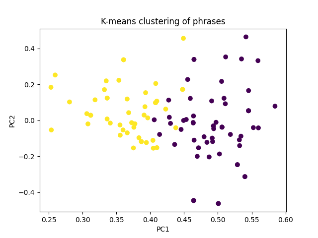

### \#\#\#\# AUTOMATICALLY GENERATED, DO NOT EDIT MANUALLY \#\#\#\#  
*This file was generated by divyaamirtharaj on 2023-04-26 011357*  
**Dataset:** dedoose_data   

## Section Overview
**Section:** Optimism  
**Questions:** [972241, 898570]   

## Clusters
###  Cluster Breakdown: 
Cluster 0 accounted for 55.05% of the responses. Cluster 1 accounted for 44.95% of the responses.   

###  Cluster Demographics: 
Respondents in cluster 1 were on average 35.36 years old, and 57.14% are/were married and 50.0% are widowed.  Respondents in cluster 0 were on average 32.16 years old, and 38.0% are/were married and 33.33% are widowed.    

###  Cluster Descriptions: 
The phrases were clustered into two groups based on the sentiment of the responses. The first cluster (0) consists of phrases that express a lack of optimism and a feeling of hopelessness in regards to achieving justice, while the second cluster (1) consists of phrases that express hope and optimism that justice will be served.

The major theme found in cluster 0 is despair and a lack of faith in the justice system. The respondents in this cluster express a feeling of hopelessness that justice will ever be served, and they indicate a lack of faith in the justice system or in the ability of foreign countries to bring prisoners to justice. They also express a feeling of resignation that their rights will never be given back to them, and that even if they were, it would have already happened.

The major theme found in cluster 1 is hope and optimism. The respondents in this cluster express a strong desire for justice to be served and for their rights to be returned to them. They have faith that justice will eventually be served, and that it may be achieved both through earthly and divine means. They also express a hope that their missing families will be returned to them.

The two clusters are differentiated by the respondents' levels of optimism. The respondents in cluster 0 express a lack of optimism and hope, while the respondents in cluster 1 express an optimistic outlook and faith that justice will eventually be served.   

***
 

## Appendix:  
**Cluster Graph:**  
  

**Clusters:**  
{1: ['R is seeking a complete eradication of ISIS in order to achieve justice for their crimes. They believe that justice can only be achieved through disappearing the terrorist organization. R is not optimistic about ever getting justice and believes that ISIS will never be over.', 'R is seeking a complete eradication of ISIS in order to achieve justice for their crimes. They believe that justice can only be achieved through disappearing the terrorist organization. R is not optimistic about ever getting justice and believes that ISIS will never be over.', 'R is seeking a complete eradication of ISIS in order to achieve justice for their crimes. They believe that justice can only be achieved through disappearing the terrorist organization. R is not optimistic about ever getting justice and believes that ISIS will never be over.', "R: Bringing those people who committed atrocities against me to justice is very important to me. R: I have faith that justice will eventually be served, but I want to experience it firsthand to be sure. I'm hopeful, but I cannot give a definitive number to express my optimism.", 'R: It is very important for me that justice is manifested to its fullest extent. R: I am optimistic that justice will take place.', 'R is resigned to the fact that they will never receive the justice they deserve from ISIS, regardless of what might happen to them. R believes that justice will be done since with God, nothing is impossible.', 'R: It is extremely important for me to get our rights back from Isis, with a priority rating of four out of four. The actions of Isis were particularly damaging to us. R is optimistic that they will get justice, and is hopeful for a successful outcome until at least four. They trust that God will provide justice.', "The respondent views Justice as being extremely important and a top priority. R has a strong hope that they will eventually get Justice and have their rights restored. They express this hope by saying they will never lose hope and that, through God's will, they will receive Justice.", 'As a Yazidi who experienced the conflict with ISIS firsthand, it is of utmost importance to me that Yazidi people get their rights. The lives of those still in camps are dire, with limited access to food, water, and electricity. I want to ensure that this suffering is not in vain and that we can create a better future for those who are still in camps. I am not sure if I will get justice and my rights, so I am not very optimistic.', 'R has experienced a great deal of violence and suffering at the hands of Isis, including the loss of two of their children, who are either missing or in captivity. They are desperate for justice and for the return of their rights, as well as the return of their missing children, which is of utmost importance to them. As a respondent, I am hopeful that my husband and daughter will return, but I am uncertain due to certain events.', "As a respondent, I believe that it is very important that justice is achieved in regards to Daesh fighting. We want them to be removed from the world and to stop their destructive actions, and for a country to step in and put a stop to them. R is hopeful that justice will be achieved both on earth and with God's help. They are motivated by their experiences in Kocho, where Daesh had taken everyone without leaving any behind.", "R: It is very important for me to have justice and my rights restored. We are hopeful that someone will be able to make this happen. R: I'm trying to be optimistic, but I'm not sure if I'm being realistic. I'm just hoping that things will eventually get better.", "From the respondent's perspective, having justice is extremely important. I am feeling somewhat optimistic that I am going to get justice, as I can see that many others have gone through similar experiences, however, my faith in the Government has decreased significantly. My level of optimism is at a 2 out of 4.", "From the respondent's perspective, having justice is extremely important. I am feeling somewhat optimistic that I am going to get justice, as I can see that many others have gone through similar experiences, however, my faith in the Government has decreased significantly. My level of optimism is at a 2 out of 4.", 'As the respondent, I feel strongly that justice needs to be served against ISIS, as 8 of my families have been affected and my son is currently in the military fighting for that justice. Having that justice come to fruition would bring me a great sense of peace and closure. R: I am hopeful that justice will be served and that God will not forget us.', 'R: From my perspective, justice can only be achieved if Yazidis and Christians can live together in harmony, as we had before. We must not allow Sunni Arabs to have any political control, as they have betrayed us in the past. We want them to be held accountable for their actions, and to ensure that our rights are restored. R indicated that having justice in the world is very important to them because ISIS was attempting to eradicate Christian and Yazidi religions, and asked them to convert to Islam. Despite this, they remain loyal to their own religion and hope for justice, although they are aware that achieving it may be difficult.', 'R: I consider justice to be very important, rating it at 4 out of 4 in terms of importance. R is feeling half-hopeful that they will be given their rights back, despite not having seen any justice in the past.', 'From my perspective, justice is of the utmost importance. I have personally witnessed people in my home country being treated unjustly and cruelly, and this is why I decided to come to this country. Justice must be upheld and visible at all times. The respondent believes that justice will be served and that their rights will be restored one day.', 'R: I consider it to be of utmost importance to get my rights back. I want justice. R is not optimistic about having justice, as they feel that the people who wronged them have all been killed, and so there is no one left to give them their rights back. They just want the war to be over.', 'Justice is very important to me due to the cruelties I experienced at the hands of ISIS. R believes that it is too difficult for them to regain their rights and therefore, their answer is no.', "R: It is very important to me that Iraq improves so that I can go back home and reclaim my rights that were taken away due to the violence I experienced. As a respondent, I feel scared and uncertain about the current situation in Iraq and don't have much hope for achieving justice.", 'From the perspective of the respondent, it is extremely important to have justice for what happened during the conflict with ISIS. R: No, I have not received any justice yet despite trying various avenues to seek it. I have even gone to Iraq in search of justice, but have still not found the person responsible for holding my family captive.', 'From my perspective, it is extremely important to have my rights protected after ISIS. R: I have doubts that I will ever have my rights due to not understanding the numbers technique of evaluation.', 'From my perspective, it is extremely important to have my rights protected after ISIS. R: I have doubts that I will ever have my rights due to not understanding the numbers technique of evaluation.', 'R believes that it is extremely important to have justice and their rights secured. R: I do not have any hope that my rights will be secured, as I have not experienced anything that would give me reason to be hopeful.', 'From the perspective of the respondent, justice is very important and should be pursued until there is a resolution. R: I have a lot of optimism that my rights will be returned.', 'R has rated justice as a 5 out of 10 priority. R is not hopeful that they will receive justice.', 'R has rated justice as a 5 out of 10 priority. R is not hopeful that they will receive justice.', 'R believes that it is essential to hold ISIS accountable for their actions and that they should receive a punishment that is twice as severe as the suffering they inflicted on others. R believes that justice will be done.', "For me, it is extremely important to have justice for what happened to me during ISIS. I have only seen injustice in my life so far, and now I want to see justice. R: I don't believe that I will ever get justice and I find it very difficult.", 'R: I have not seen justice so far, and I believe that international standards should be established in order to ensure that justice is achieved. R: I have hope that I will receive justice in the end.', 'R: It is very important to me to regain my rights from ISIS. R has very little hope that the situation will improve, giving it a rating of one out of ten.', 'As a respondent, I find it extremely important to get justice, as my kids have suffered greatly in Syria with no food or resources. The respondent is uncertain about whether they will get justice, but they remain hopeful that God will help them get their rights back.', 'From the perspective of the respondent, it is important for them to give me back what is my right and I would rate it a four out of four in importance. If I am not given what is my right, I will just leave them away and continue with my life freely. From my perspective, I do not believe that my rights will be given to me at this point; I give it a score of one.', 'From the perspective of the respondent, it is important for them to give me back what is my right and I would rate it a four out of four in importance. If I am not given what is my right, I will just leave them away and continue with my life freely. From my perspective, I do not believe that my rights will be given to me at this point; I give it a score of one.', 'As the respondent, I understand the importance of holding ISIS accountable for their actions and I am willing to rate it as a 4 on a scale of importance. R: I have no hope that they will be held accountable.', 'R wants their rights to be given back to them very much, and they agree that four is a suitable amount. R: I have a lot of hope that I will be granted my rights, and I am thankful for that hope that I have in God. I would rate my hope out of four as a four.', 'As a respondent, I believe getting my rights back is very important and I rate it as number 4 on the scale. She expressed her sadness and despair due to the loss of her husband, and concluded that she does not believe she will be able to get justice.', 'R believes that justice must be done in favor of all those who were oppressed by ISIS, including Yazidis, Kurds, and Kurdish Yazidis. The PKK and Syrian Kurds were essential in rescuing them, and their kindness and strength should not be forgotten. Justice is very important to the respondent, as they long to be able to return to their home and family if the lands were to be liberated. R: I am hopeful that I will find justice and I rate my level of hope as 3 out of 5.', 'I believe it is very important for me to receive justice. R: I have a strong belief that justice will be done.', 'R: Very much, I consider it of the utmost importance. R: I am very confident that I will get my right.', "From my perspective, the importance of getting my rights back from ISIS is very high - I would rate it a four out of five. From my perspective, I don't believe we'll get our rights, but I rate the likelihood of it happening at 3 out of 4.", 'R believes that it is very important to have justice and that those responsible for wrongdoings should be held accountable for their actions. R is relying on her faith in God to restore her rights, expressing her hope and trust that God will answer her prayer. She gestures to demonstrate the depth of her faith.', 'R: Justice is very important to me. From my perspective, I have not seen anything positive since now and it has been four years since this issue began. I am hopeful that justice will be served soon.', 'From my perspective, justice for what happened in the Isis conflict is of great importance. I am extremely optimistic that I will get justice.', "As the respondent, I feel it is absolutely essential that my rights are remedied in order to address the wrongs I have experienced. The injustice I have seen cannot be overstated, and only through remedying my rights can I find some relief. R: I have hope in God that He will provide us with justice and recognize our rights, despite the suffering and trauma our family has endured due to the captivity of 15 men and 3 girls from my husband's family. Sadly, 28 people remain held captive by Daesh gangs.", "As the respondent, I feel it is absolutely essential that my rights are remedied in order to address the wrongs I have experienced. The injustice I have seen cannot be overstated, and only through remedying my rights can I find some relief. R: I have hope in God that He will provide us with justice and recognize our rights, despite the suffering and trauma our family has endured due to the captivity of 15 men and 3 girls from my husband's family. Sadly, 28 people remain held captive by Daesh gangs.", 'Having justice for Isis is extremely important to me as it will bring a sense of safety and security. I am not optimistic about finishing isis, and I would rate my optimism as 0.', 'R expresses that they strongly desire justice for what happened to them during the conflict with ISIS. R is not optimistic about getting justice.'], 0: ['From the perspective of the respondent, it is extremely important to have justice for what happened to them. R is not very optimistic and believes that the countries should do something to bring about improvement, but has not seen any so far. They rate their optimism at 3 out of 10.', "From the perspective of the respondent, it is very important for them to take their rights for what ISIS did to them. From the respondent's perspective, they believe that there is only a slight chance that the people in question will be held accountable, and that this may only happen if God allows it.", 'R: It is extremely important to me to regain my rights that were taken away by ISIS, and I hope that God does not allow them to keep what belongs to me. From the perspective of the respondent, they have a lot of hope that they will get their rights back, however they understand that it is not going to be an easy process.', 'From the perspective of the respondent, justice is of great importance. From the perspective of the respondent, it is very difficult to get justice.', "I asked the respondent about their experience with ISIS and if they think their rights will be restored. They responded that they hope their rights will be restored if governments are able to retrieve the things that were taken from them, such as money, cars, and sheep, as well as their freedom. They also mentioned that they were beaten and held captive for one year. They don't know if they will ever get their rights back, but they remain hopeful. From the perspective of the respondent, they do not understand the situation and are unsure if their rights will be returned to them. They are asking the other person if they think their rights will be returned.", "I asked the respondent about their experience with ISIS and if they think their rights will be restored. They responded that they hope their rights will be restored if governments are able to retrieve the things that were taken from them, such as money, cars, and sheep, as well as their freedom. They also mentioned that they were beaten and held captive for one year. They don't know if they will ever get their rights back, but they remain hopeful. From the perspective of the respondent, they do not understand the situation and are unsure if their rights will be returned to them. They are asking the other person if they think their rights will be returned.", "R is indicating that they experienced violence at the hands of Isis, but is not answering the question of how important it is for them to receive justice for that violence. From the respondent's perspective, they do not believe that they will ever get justice for the things they have experienced.", 'From the perspective of the respondent, justice is of utmost importance. R is not optimistic that they will ever get justice for the terrible crimes committed by ISIS, such as killing women and girls.', 'The film is almost finished, and it will be released soon. It is a documentary about my story and the stories of other Yazidi women who have been victims of ISIS. From the perspective of the respondent, they do not have any faith in the justice system and have experienced a lot of hardship. They have seen evidence of justice happening only when foreign countries take on cases and bring prisoners to their countries, leading them to believe that justice is only attainable on a global scale.', 'From the perspective of the respondent, it is very important to have their rights given back to them, and they would feel relieved if they were able to get them back. R is expressing a feeling of hopelessness and resignation that their rights will not be given to them, and that if they were going to be given, it would have already happened. They are overwhelmed by the amount of suffering they have experienced.', 'From the perspective of the respondent, justice is very important. From the perspective of the respondent, they believe that justice will be brought to them in a significant amount.', 'From the perspective of the respondent, reclaiming their rights is very important. The respondent believes there is a possibility of getting their rights back.', "As the respondent, I consider it to be very important to know what happened during the conflict with Isis in Iraq and to seek information about what is happening, so I rate it as a 4 out of 4 in terms of its importance. From the respondent's perspective, it is clear that they do not believe that justice will be served, as they have seen examples of injustice firsthand. They do not have any hope that justice will be served, as they feel that it is not based on fairness or conscience.", "R believes that justice has not yet been served in this case, as nobody has mentioned or taken into account the respondent's perspective. R does not have any hope that their rights will be served, believing that no matter what happens to ISIS, it will not pay for the sufferings they have experienced. They have experienced hunger, suffering, and violence and do not think their right can be calculated.", "R believes that justice has not yet been served in this case, as nobody has mentioned or taken into account the respondent's perspective. R does not have any hope that their rights will be served, believing that no matter what happens to ISIS, it will not pay for the sufferings they have experienced. They have experienced hunger, suffering, and violence and do not think their right can be calculated.", "R believes that justice has not yet been served in this case, as nobody has mentioned or taken into account the respondent's perspective. R does not have any hope that their rights will be served, believing that no matter what happens to ISIS, it will not pay for the sufferings they have experienced. They have experienced hunger, suffering, and violence and do not think their right can be calculated.", 'R considers it very important to have justice for what happened to them with Isis. From the perspective of the respondent, I am 50% optimistic that I will never get justice and I chose the second option.', 'R considers it very important to have justice for what happened to them with Isis. From the perspective of the respondent, I am 50% optimistic that I will never get justice and I chose the second option.', 'From the perspective of the respondent, justice is extremely important due to the violence they have experienced from Isis. They rated this importance a 4 out of 4. The respondent does not believe that they will get justice, regardless of the amount.', "From the respondent's perspective, they are unsure of how important it is for justice to be done. R believes that justice will be done against ISIS and that their rights will come back to them.", 'From the perspective of the respondent, it is very important to them to receive justice as it is linked to their family being reunited. R is very optimistic about getting justice.', 'From the perspective of the respondent, it is extremely important to have justice for what happened during the conflict with ISIS. They feel that they need help from the outside to forget what happened and to help their men who have been left in camps without assistance. Furthermore, they are angry at the "dirty arabs" who are taking their money and possessions. R: I find it hard to be hopeful that I will get justice.', "From the respondent's perspective, it is unclear what is being asked and what the possible punishments for ISIS could be. They understand that it is important for them to have their rights back, but are unsure of how this can be achieved. R does not believe that their rights will be granted in the future.", 'R wants ISIS to be held accountable for the violations they committed against them and to be punished for their actions. From the perspective of the respondent, they are not optimistic that they will get justice, as they do not believe that those responsible for the injustice will be punished.', 'R believes it is very important to have their rights restored and for the perpetrators of any wrongdoings to be held accountable. R is not optimistic they will get justice.', 'From the perspective of the respondent, it is very important to have justice served for the atrocities committed by ISIS. They believe that the only way to do this is to make ISIS suffer the same way they made them suffer, such as killing their people, taking captives, beating them, and taking their little girls. They would rate the importance of justice being served a 4 on a scale of 0 to 4. R has a strong sense of optimism that their rights will eventually be restored.', "From the respondent's perspective, justice for what happened to them is very important. As a respondent, I feel that justice will not be served for the atrocities that have been committed against my village. The number of people affected by ISIS is vast, with 700 men and young men killed, 1750 people displaced, and children and women taken away from their families. The air raids only compounded the tragedy, leaving me feeling that nothing will ever be the same.", "R: It is very important to me to have my rights restored for what I experienced, and I also feel strongly that there are many other women who have experienced similar injustices and should have their rights restored, too. The respondent does not believe that they will get their rights back and that if their house is rebuilt, it will not be done properly due to people in positions in Iraq being 'smart' and using 'tricks' to take advantage of the situation.", 'R considers it very important to have their rights respected and to receive justice for what ISIS did to them. R is feeling pessimistic about their situation, believing that they will not be able to get their rights, and answering "Yes" to the question of whether they believe they will get their rights.', "From the respondent's perspective, Justice and rights are highly important and a priority. From the perspective of the respondent, they do not believe they will ever get their rights back in Iraq.", 'From the perspective of the respondent, it is very important that ISIS take responsibility for the wrongs that have been done and that justice is served. However, the respondent acknowledges that it is unlikely that all of ISIS will be brought to justice due to the difficulty of the situation. She believes that the crisis will end eventually, but it will take a very long time for it to happen.', 'R: It is very important to me that ISIS be removed from Iraq, so that I can get my rights back. I hope that the Kurdistan government can catch them all and restore my rights. I would rate this as a 4 out of 4 in terms of priority for me. R has expressed that they have hope that their rights will be restored even if they only have one year left in their life. They also feel strongly that justice should be served to those who have hurt them and their children, including their 10 year-old daughter.', 'R is expressing a sense of hopelessness and frustration that any justice will come from seeking justice for the violence inflicted on them by Isis. They feel that it is a futile effort and that any attempts to seek justice will only cause more pain and suffering. R is not optimistic that they will get justice and is not expecting it to end soon. They feel that justice is important, but do not think it is achievable.', 'From the perspective of the respondent, justice is extremely important. R: I am optimistic that I will get justice.', 'R believes that justice should be served for the wrongs done to them, such as the killing of men, taking of sons, daughters, and women. They feel that they should be compensated, such as by returning those who are still alive and by providing their rights. However, they do not believe that justice is very important and would rather see their living spaces cleaned and tent towns eliminated. From the perspective of the respondent, they do not believe that their rights will be returned and they are seeking retribution for the wrongs that have been done to them.', 'R believes that justice should be served for the wrongs done to them, such as the killing of men, taking of sons, daughters, and women. They feel that they should be compensated, such as by returning those who are still alive and by providing their rights. However, they do not believe that justice is very important and would rather see their living spaces cleaned and tent towns eliminated. From the perspective of the respondent, they do not believe that their rights will be returned and they are seeking retribution for the wrongs that have been done to them.', 'From the perspective of the respondent, justice for ISIS violations is very important. R is not optimistic that justice will be achieved.', 'From the perspective of the respondent, justice is very important and is synonymous with truth. The respondent does not have much faith that justice will be served for them, but they are not completely without hope, so they rate it as a 1 rather than zero.', 'From the perspective of the respondent, justice is very important and is synonymous with truth. The respondent does not have much faith that justice will be served for them, but they are not completely without hope, so they rate it as a 1 rather than zero.', "From the respondent's perspective, justice is essential and they feel strongly about avenging the wrongs done to them by ISIS. R is not optimistic that they will ever get justice for the atrocities committed by ISIS against women and girls.", 'From my perspective, justice for ISIS violations is important to me and I would rate it at a 4 out of 5. R is not very optimistic that justice will be achieved.', 'From the perspective of the respondent, it is disappointing that ISIS will not be put on trial, as it is seen as an important step in bringing justice to the victims of their violence. From the perspective of the respondent, they are disappointed that even if ISIS is defeated, they will not be put on trial.', 'From the perspective of the respondent, it is disappointing that ISIS will not be put on trial, as it is seen as an important step in bringing justice to the victims of their violence. From the perspective of the respondent, they are disappointed that even if ISIS is defeated, they will not be put on trial.', 'From the perspective of the respondent, it is disappointing that ISIS will not be put on trial, as it is seen as an important step in bringing justice to the victims of their violence. From the perspective of the respondent, they are disappointed that even if ISIS is defeated, they will not be put on trial.', 'R believes that it is extremely important for justice to be served for the treatment of the Yazidis, and for Isis to be punished. They have experienced a lot of pain and trauma, and it is essential that the situation in Iraq improves and Isis is removed in order to restore their rights and dignity. I believe that I will receive justice until the last level, as the Yazidis have never done wrong by anyone and have not killed anyone.', "From the respondent's perspective, justice for the wrongs inflicted by ISIS is of great importance. The respondent does not believe they will ever have justice.", 'I believe that the violence I experienced at the hands of Isis was very significant and that obtaining my rights is extremely important. The respondent does not believe they are going to get their rights.', 'From the perspective of the respondent, it is impossible to live alongside those who took their sisters, killed their brothers and fathers. It is incredibly important for them to get their rights back from those who have oppressed them, and for those responsible to experience what the respondent has gone through. However, as long as Arabs live in the same area, this will not be possible. From the perspective of the respondent, I am very optimistic that we will eventually get justice and those who have wronged us will get what they deserve. When asked to rate this on a scale, I provided an answer.', 'It is very important to me that justice is served and that the perpetrators of the cruelty I suffered stand trial for their actions. I would rate this a 4 on a scale of importance. R does not believe that justice will be served to those who caused harm, as they are their neighbors and they no longer trust Muslims.', 'As a respondent, I strongly feel that ISIS should be held accountable for the violations they have committed against me and receive justice for their actions. I believe it is essential that they be removed from the world in order to protect the innocent people of Syria and Iraq. The respondent does not believe that the authorities or other countries will bring the offenders to justice, as they are relying solely on the Hashad Al-Shaabi army to fight them.', 'For me, the most important thing is that my husband is alive and is able to escape from captivity, where he has been for the past three years. It is more important than any sort of justice for the things that Isis has done to us. The respondent believes that true justice for them would be for their husband to escape from ISIS captivity, and that anything else is not justice. They feel that they have been denied justice for the past three years, and that it is out of their power to do anything to change that.', 'The respondent is expressing the importance of seeking justice and compensation for what happened to them during the conflict with Isis. They have family members who have been taken captive and they are desperate for news of them. The respondent has expressed a desire for the perpetrators of these acts to be punished, and for their family members to be found. They have expressed gratitude when the interviewer expressed sympathy for their situation. The respondent has indicated that they are ready to continue with the questions. R believes that justice will not be done for them.', "The respondent acknowledges that the perpetrators of the crimes have all dispersed and fled to different countries and that it is difficult to identify and locate them. They express a sense of helplessness, asking “what can we do?”, implying that they recognize the difficulty in bringing the perpetrators to justice. From the respondent's perspective, the situation is uncertain and chaotic, as everyone has scattered to different countries and nobody knows who is who or where they have gone. The respondent is asking what can be done in this difficult situation.", 'From the perspective of the respondent, having justice is very important and they have been praying to God for justice. R believes that they will ultimately receive justice, as they have faith that God will deliver it.', 'From the perspective of the respondent, having justice is very important and they have been praying to God for justice. R believes that they will ultimately receive justice, as they have faith that God will deliver it.', 'From the perspective of the respondent, having justice is very important and they have been praying to God for justice. R believes that they will ultimately receive justice, as they have faith that God will deliver it.', 'The respondent emphasizes the importance of getting their rights back, despite the realization that this cannot undo the harm done by ISIS. They express frustration that the world has not stood with them, but still recognize the importance of reclaiming their rights. From the perspective of the respondent, they are not confident that they will be compensated for the difficulties they have experienced and do not believe that anyone will hold those responsible accountable.', 'The respondent emphasizes the importance of getting their rights back, despite the realization that this cannot undo the harm done by ISIS. They express frustration that the world has not stood with them, but still recognize the importance of reclaiming their rights. From the perspective of the respondent, they are not confident that they will be compensated for the difficulties they have experienced and do not believe that anyone will hold those responsible accountable.', 'From the perspective of the respondent, they feel that whatever is being discussed is very important. As a respondent, I have a strong faith in God that He will give us justice. Regardless of the outcome, I will remain committed to asking for justice from God.', 'Yes, it is very important for me to have justice for what happened to me during the conflict with ISIS. The respondent does not believe that justice will come for them and is not optimistic about it happening.']}  

**Demographic Breakdown:**  
{1: [{'sex': 'female', 'age': '35', 'marital_status': 'True', 'widow': 'False', 'ethnicity': '', 'religion': ''}, {'sex': 'female', 'age': 'NULL', 'marital_status': 'NULL', 'widow': 'NULL', 'ethnicity': 'NULL', 'religion': 'NULL'}, {'sex': 'female', 'age': 'NULL', 'marital_status': 'NULL', 'widow': 'NULL', 'ethnicity': 'NULL', 'religion': 'NULL'}, {'sex': 'female', 'age': '39', 'marital_status': 'False', 'widow': 'NULL', 'ethnicity': '', 'religion': ''}, {'sex': 'female', 'age': 'NULL', 'marital_status': 'False', 'widow': 'NULL', 'ethnicity': 'NULL', 'religion': ''}, {'sex': 'female', 'age': 'NULL', 'marital_status': 'True', 'widow': 'True', 'ethnicity': '', 'religion': ''}, {'sex': 'female', 'age': 'NULL', 'marital_status': 'NULL', 'widow': 'NULL', 'ethnicity': '', 'religion': 'Yazidi'}, {'sex': 'female', 'age': '77', 'marital_status': 'True', 'widow': 'True', 'ethnicity': '', 'religion': ''}, {'sex': 'female', 'age': 'NULL', 'marital_status': 'False', 'widow': 'False', 'ethnicity': '', 'religion': ''}, {'sex': 'female', 'age': '37', 'marital_status': 'True', 'widow': 'True', 'ethnicity': '', 'religion': ''}, {'sex': 'female', 'age': '37', 'marital_status': 'True', 'widow': 'True', 'ethnicity': '', 'religion': 'Ezidism'}, {'sex': 'female', 'age': '40', 'marital_status': 'True', 'widow': 'True', 'ethnicity': '', 'religion': ''}, {'sex': 'female', 'age': '37', 'marital_status': 'False', 'widow': 'NULL', 'ethnicity': '', 'religion': ''}, {'sex': 'female', 'age': 'NULL', 'marital_status': 'NULL', 'widow': 'NULL', 'ethnicity': 'NULL', 'religion': 'NULL'}, {'sex': 'female', 'age': 'NULL', 'marital_status': 'Unfortunately, I do not have that information.', 'widow': 'NULL', 'ethnicity': 'Kurdish Ezidi', 'religion': ''}, {'sex': 'female', 'age': 'NULL', 'marital_status': 'False', 'widow': 'NULL', 'ethnicity': '', 'religion': ''}, {'sex': 'female', 'age': '20', 'marital_status': 'False', 'widow': 'NULL', 'ethnicity': '', 'religion': ''}, {'sex': 'female', 'age': '21', 'marital_status': 'True', 'widow': 'NULL', 'ethnicity': 'Kurdish Yazidi', 'religion': ''}, {'sex': 'female', 'age': '35', 'marital_status': 'True', 'widow': 'False', 'ethnicity': 'NULL', 'religion': ''}, {'sex': 'female', 'age': 'NULL', 'marital_status': 'True', 'widow': 'False', 'ethnicity': '', 'religion': ''}, {'sex': 'female', 'age': '33', 'marital_status': 'True', 'widow': 'False', 'ethnicity': '', 'religion': ''}, {'sex': 'female', 'age': '36', 'marital_status': 'False', 'widow': 'True', 'ethnicity': '', 'religion': ''}, {'sex': 'female', 'age': '28', 'marital_status': 'True', 'widow': 'True', 'ethnicity': '', 'religion': 'Yezidi.'}, {'sex': 'female', 'age': 'NULL', 'marital_status': 'NULL', 'widow': 'False', 'ethnicity': 'NULL', 'religion': 'Yazidi'}, {'sex': 'female', 'age': '23', 'marital_status': 'False', 'widow': 'NULL', 'ethnicity': '', 'religion': ''}, {'sex': 'female', 'age': 'NULL', 'marital_status': 'NULL', 'widow': 'NULL', 'ethnicity': 'NULL', 'religion': ''}, {'sex': 'female', 'age': '27', 'marital_status': 'True', 'widow': 'NULL', 'ethnicity': '', 'religion': 'NULL'}, {'sex': 'female', 'age': 'NULL', 'marital_status': 'NULL', 'widow': 'NULL', 'ethnicity': 'NULL', 'religion': 'NULL'}, {'sex': 'female', 'age': 'NULL', 'marital_status': 'False', 'widow': 'NULL', 'ethnicity': '', 'religion': ''}, {'sex': 'female', 'age': 'NULL', 'marital_status': 'True', 'widow': 'True', 'ethnicity': '', 'religion': ''}, {'sex': 'female', 'age': 'NULL', 'marital_status': 'Therefore, I cannot answer this question.', 'widow': 'NULL', 'ethnicity': 'NULL', 'religion': 'NULL'}, {'sex': 'female', 'age': 'NULL', 'marital_status': 'NULL', 'widow': 'NULL', 'ethnicity': '', 'religion': ''}, {'sex': 'female', 'age': '', 'marital_status': 'True', 'widow': 'NULL', 'ethnicity': 'Yazidi', 'religion': ''}, {'sex': 'female', 'age': 'NULL', 'marital_status': 'False', 'widow': 'NULL', 'ethnicity': '', 'religion': ''}, {'sex': 'female', 'age': 'NULL', 'marital_status': 'NULL', 'widow': 'NULL', 'ethnicity': 'NULL', 'religion': 'NULL'}, {'sex': 'female', 'age': '73', 'marital_status': 'False', 'widow': 'True', 'ethnicity': 'Yazidi.', 'religion': ''}, {'sex': 'female', 'age': '18', 'marital_status': 'False', 'widow': 'NULL', 'ethnicity': '', 'religion': ''}, {'sex': 'female', 'age': '37', 'marital_status': 'True', 'widow': 'True', 'ethnicity': 'NULL', 'religion': 'Yazidi'}, {'sex': 'female', 'age': '', 'marital_status': 'True', 'widow': 'False', 'ethnicity': '', 'religion': ''}, {'sex': 'female', 'age': '19', 'marital_status': 'NULL', 'widow': 'False', 'ethnicity': '', 'religion': ''}, {'sex': 'female', 'age': 'Therefore, it is unclear. NULL', 'marital_status': 'NULL', 'widow': 'NULL', 'ethnicity': 'NULL', 'religion': 'NULL'}, {'sex': 'female', 'age': '40', 'marital_status': 'NULL', 'widow': 'False', 'ethnicity': '', 'religion': ''}, {'sex': 'female', 'age': 'NULL', 'marital_status': 'False', 'widow': 'NULL', 'ethnicity': '', 'religion': ''}, {'sex': 'female', 'age': '', 'marital_status': 'True', 'widow': 'False', 'ethnicity': '', 'religion': ''}, {'sex': 'female', 'age': '', 'marital_status': 'True', 'widow': 'True', 'ethnicity': '', 'religion': ''}, {'sex': 'female', 'age': '39', 'marital_status': 'False', 'widow': 'False', 'ethnicity': 'NULL', 'religion': ''}, {'sex': 'female', 'age': '', 'marital_status': 'False', 'widow': 'True', 'ethnicity': '', 'religion': ''}, {'sex': 'female', 'age': 'NULL', 'marital_status': 'True', 'widow': 'NULL', 'ethnicity': '', 'religion': ''}, {'sex': 'female', 'age': '27', 'marital_status': 'True', 'widow': 'False', 'ethnicity': '', 'religion': ''}], 0: [{'sex': 'female', 'age': '36', 'marital_status': 'True', 'widow': 'False', 'ethnicity': '', 'religion': ''}, {'sex': 'female', 'age': '36', 'marital_status': 'False', 'widow': 'NULL', 'ethnicity': '', 'religion': 'Yazidi'}, {'sex': 'female', 'age': '45', 'marital_status': 'True', 'widow': 'False', 'ethnicity': '', 'religion': ''}, {'sex': 'female', 'age': 'NULL', 'marital_status': 'True', 'widow': 'True', 'ethnicity': '', 'religion': ''}, {'sex': 'female', 'age': '50', 'marital_status': 'False', 'widow': 'True', 'ethnicity': 'Ezidi, German', 'religion': 'Unknown'}, {'sex': 'female', 'age': '22', 'marital_status': 'True', 'widow': 'NULL', 'ethnicity': '', 'religion': ''}, {'sex': 'female', 'age': 'NULL', 'marital_status': 'False', 'widow': 'True', 'ethnicity': '', 'religion': 'Yazidi'}, {'sex': 'female', 'age': '26', 'marital_status': 'False', 'widow': 'NULL', 'ethnicity': '', 'religion': ''}, {'sex': 'female', 'age': 'NULL', 'marital_status': 'False', 'widow': 'NULL', 'ethnicity': '', 'religion': ''}, {'sex': 'female', 'age': 'NULL', 'marital_status': 'NULL', 'widow': 'NULL', 'ethnicity': '', 'religion': ''}, {'sex': 'female', 'age': '27', 'marital_status': 'False', 'widow': 'NULL', 'ethnicity': '', 'religion': ''}, {'sex': 'female', 'age': '28-29', 'marital_status': 'False', 'widow': 'NULL', 'ethnicity': '', 'religion': ''}, {'sex': 'female', 'age': '40', 'marital_status': 'False', 'widow': 'False', 'ethnicity': '', 'religion': ''}, {'sex': 'female', 'age': '30', 'marital_status': 'True', 'widow': 'False', 'ethnicity': '', 'religion': ''}, {'sex': 'female', 'age': '24', 'marital_status': 'True', 'widow': 'False', 'ethnicity': 'Yazidi.', 'religion': ''}, {'sex': 'female', 'age': 'NULL', 'marital_status': 'NULL', 'widow': 'NULL', 'ethnicity': 'NULL', 'religion': 'NULL'}, {'sex': 'female', 'age': '27', 'marital_status': 'False', 'widow': 'NULL', 'ethnicity': '', 'religion': ''}, {'sex': 'female', 'age': 'NULL', 'marital_status': 'NULL', 'widow': 'NULL', 'ethnicity': 'NULL', 'religion': 'NULL'}, {'sex': 'female', 'age': '21', 'marital_status': 'False', 'widow': 'NULL', 'ethnicity': '', 'religion': ''}, {'sex': 'female', 'age': 'NULL', 'marital_status': 'True', 'widow': 'NULL', 'ethnicity': '', 'religion': ''}, {'sex': 'female', 'age': '44', 'marital_status': 'True', 'widow': 'False', 'ethnicity': '', 'religion': ''}, {'sex': 'female', 'age': '35', 'marital_status': 'True', 'widow': 'False', 'ethnicity': '', 'religion': ''}, {'sex': 'female', 'age': 'NULL', 'marital_status': 'False', 'widow': 'NULL', 'ethnicity': '', 'religion': ''}, {'sex': 'female', 'age': 'NULL', 'marital_status': 'NULL', 'widow': 'NULL', 'ethnicity': '', 'religion': ''}, {'sex': 'female', 'age': '33', 'marital_status': 'True', 'widow': 'True', 'ethnicity': '', 'religion': ''}, {'sex': 'female', 'age': '26', 'marital_status': 'False', 'widow': 'NULL', 'ethnicity': '', 'religion': ''}, {'sex': 'female', 'age': 'NULL', 'marital_status': 'True', 'widow': 'False', 'ethnicity': '', 'religion': ''}, {'sex': 'female', 'age': '29', 'marital_status': 'False', 'widow': 'NULL', 'ethnicity': '', 'religion': ''}, {'sex': 'female', 'age': 'NULL', 'marital_status': 'False', 'widow': 'NULL', 'ethnicity': '', 'religion': ''}, {'sex': 'female', 'age': 'NULL', 'marital_status': 'False', 'widow': 'NULL', 'ethnicity': '', 'religion': ''}, {'sex': 'female', 'age': '31', 'marital_status': 'False', 'widow': 'False', 'ethnicity': '', 'religion': ''}, {'sex': 'female', 'age': '32', 'marital_status': 'True', 'widow': 'NULL', 'ethnicity': '', 'religion': ''}, {'sex': 'female', 'age': 'NULL', 'marital_status': 'False', 'widow': 'NULL', 'ethnicity': '', 'religion': ''}, {'sex': 'female', 'age': '50', 'marital_status': 'False', 'widow': 'NULL', 'ethnicity': '', 'religion': 'Yazidi.'}, {'sex': 'female', 'age': '31', 'marital_status': 'True', 'widow': 'True', 'ethnicity': 'NULL', 'religion': ''}, {'sex': 'female', 'age': 'NULL', 'marital_status': 'NULL', 'widow': 'NULL', 'ethnicity': 'Yazidi.', 'religion': ''}, {'sex': 'female', 'age': '19', 'marital_status': 'False', 'widow': 'NULL', 'ethnicity': '', 'religion': 'NULL'}, {'sex': 'female', 'age': 'NULL', 'marital_status': 'True', 'widow': 'False', 'ethnicity': '', 'religion': ''}, {'sex': 'female', 'age': 'NULL', 'marital_status': 'NULL', 'widow': 'NULL', 'ethnicity': 'NULL', 'religion': 'NULL'}, {'sex': 'female', 'age': '26', 'marital_status': 'False', 'widow': 'NULL', 'ethnicity': '', 'religion': ''}, {'sex': 'female', 'age': '19', 'marital_status': 'False', 'widow': 'NULL', 'ethnicity': '', 'religion': 'NULL'}, {'sex': 'female', 'age': '', 'marital_status': 'False', 'widow': 'NULL', 'ethnicity': '', 'religion': ''}, {'sex': 'female', 'age': 'NULL', 'marital_status': 'NULL', 'widow': 'NULL', 'ethnicity': 'NULL', 'religion': 'NULL'}, {'sex': 'female', 'age': 'NULL', 'marital_status': 'NULL', 'widow': 'NULL', 'ethnicity': 'NULL', 'religion': 'NULL'}, {'sex': 'female', 'age': '23', 'marital_status': 'False', 'widow': 'NULL', 'ethnicity': '', 'religion': ''}, {'sex': 'female', 'age': '30', 'marital_status': 'False', 'widow': 'False', 'ethnicity': 'Yazidi', 'religion': ''}, {'sex': 'female', 'age': '29', 'marital_status': 'False', 'widow': 'True', 'ethnicity': '', 'religion': ''}, {'sex': 'female', 'age': 'NULL', 'marital_status': 'True', 'widow': 'False', 'ethnicity': '', 'religion': ''}, {'sex': 'female', 'age': 'NULL', 'marital_status': 'False', 'widow': 'NULL', 'ethnicity': '', 'religion': 'Yazidi'}, {'sex': 'female', 'age': 'NULL', 'marital_status': 'False', 'widow': 'NULL', 'ethnicity': '', 'religion': ''}, {'sex': 'female', 'age': '45', 'marital_status': 'True', 'widow': 'True', 'ethnicity': 'Yazidi.', 'religion': ''}, {'sex': 'female', 'age': 'NULL', 'marital_status': 'True', 'widow': 'True', 'ethnicity': '', 'religion': ''}, {'sex': 'female', 'age': '43', 'marital_status': 'True', 'widow': 'False', 'ethnicity': 'Mixed ethnicity.', 'religion': ''}, {'sex': 'female', 'age': 'NULL', 'marital_status': 'True', 'widow': 'False', 'ethnicity': '', 'religion': ''}, {'sex': 'female', 'age': 'NULL', 'marital_status': 'NULL', 'widow': 'NULL', 'ethnicity': 'NULL', 'religion': 'NULL'}, {'sex': 'female', 'age': 'NULL', 'marital_status': 'NULL', 'widow': 'NULL', 'ethnicity': 'NULL', 'religion': 'NULL'}, {'sex': 'female', 'age': '27', 'marital_status': 'False', 'widow': 'NULL', 'ethnicity': '', 'religion': ''}, {'sex': 'female', 'age': '45', 'marital_status': 'False', 'widow': 'False', 'ethnicity': '', 'religion': 'Yazidi.'}, {'sex': 'female', 'age': '', 'marital_status': 'False', 'widow': 'NULL', 'ethnicity': '', 'religion': 'Yazidi.'}, {'sex': 'female', 'age': 'NULL', 'marital_status': 'False', 'widow': 'False', 'ethnicity': '', 'religion': ''}]}  
